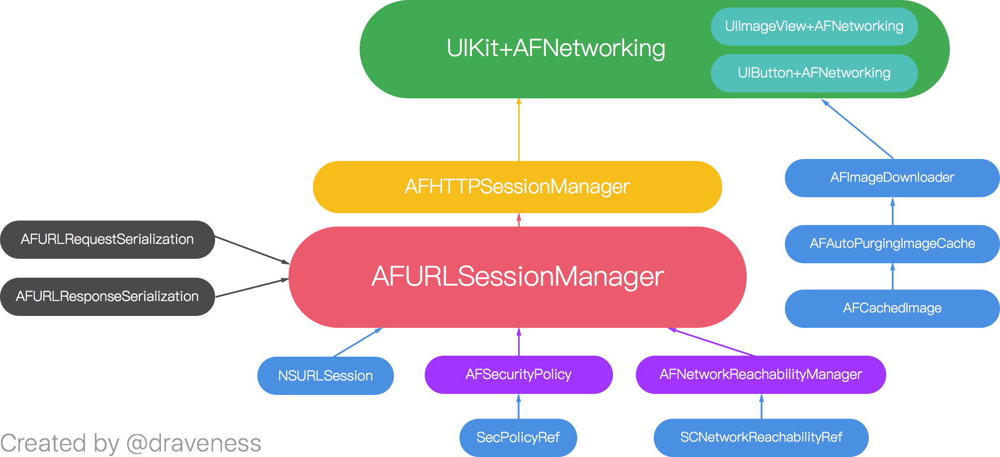

# AFNetworking源码阅读
> AFNetworking is a delightful networking library for iOS, macOS, watchOS, and tvOS. It's built on top of the Foundation URL Loading System, extending the powerful high-level networking abstractions built into Cocoa. It has a modular architecture with well-designed, feature-rich APIs that are a joy to use.

> Perhaps the most important feature of all, however, is the amazing community of developers who use and contribute to AFNetworking every day. AFNetworking powers some of the most popular and critically-acclaimed apps on the iPhone, iPad, and Mac.

开发者社区的贡献使得AFNetworking变得流行而且广受好评。

> `AFURLSessionManager` creates and manages an `NSURLSession` object based on a specified `NSURLSessionConfiguration` object, which conforms to `<NSURLSessionTaskDelegate>`, `<NSURLSessionDataDelegate>`, `<NSURLSessionDownloadDelegate>`, and `<NSURLSessionDelegate>`.

> ## Subclassing Notes

> This is the base class for `AFHTTPSessionManager`, which adds functionality specific to making HTTP requests. If you are looking to extend `AFURLSessionManager` specifically for HTTP, consider subclassing `AFHTTPSessionManager` instead.

## 概述

AFNetworking最核心的类是`AFURLSessionManager`，该类依赖于其他的类来完成整个网络请求功能。从上图可以看出，整体设计非常好，各个模块负责好自己的职责，没有入侵和耦合。

## NSURLSession

