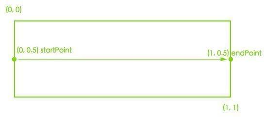

# 开发问题总结

# xcode code snippets

code snippets位置：~/Library/Developer/Xcode/UserData/CodeSnippets
前人整理的code snippets：
1. [NSHipster整理](https://github.com/Xcode-Snippets/Objective-C)
2. [唐巧的code snippets](https://github.com/tangqiaoboy/xcode_tool)

# 修改项目名称

[在iOS项目中，如何完美的修改项目名称](https://www.jianshu.com/p/2887d6fb5769)

这段时间新建项目，把以前的项目拷贝过来直接修改，参照上面的步骤，另外pod有些坑：
1. target里的pod framework旧的需要移除。
2. 如果移除某一个资源文件，比如bundle，需要在target的build phases-copy bundle resource 里移除相关资源。
3. target里的build settings需要同步修改info.plist，xx.entitlements等文件路径。
4. framewordk search path和library search paths里有无用和错误的路径也要修改、移除。

# 项目添加pch

创建pch文件，进入target-buld setting搜索“prefix header”，找到Prefix Header，添加
> $(PROJECT_DIR)/xxx/HWMyProject.pch

# 项目中对状态栏(UIStatusBar)style的修改

在早期的版本中，我们可能会通过直接对statusBar的style进行修改，例如下面这种：

```Objective-C
[[UIApplication sharedApplication] setStatusBarStyle:UIStatusBarStyleLightContent animated:NO];
```

但是这样不够灵活配置，我们可能希望不同的controller显示不同的style。UIViewController中定义的有属性：

```Objective-C
@property(nonatomic, readonly) UIStatusBarStyle preferredStatusBarStyle;
```
我们可以在子类中重写该属性Getter方法，来实现不同的style。
但是如果controller被使用在UINavigationController | UITabBarController容器中的话，我们需要重写`ildViewControllerForStatusBarStyle`来返回NavigationController或UITabBarController根据哪个子controller来显示StatusBar颜色。

一般来说，我们需要的是可见的或者最顶层的controller来现在StatusBar Style。

那么简单的做法是用Category：

```Objective-C
@interface UINavigationController (JYDriverStatusBar)

@end

@implementation UINavigationController (JYDriverStatusBar)

- (UIViewController *)childViewControllerForStatusBarStyle {
	return self.visibleViewController;
}

@end
```

# UIScrollView 获取page index

```Objective-C
- (void)scrollViewDidEndDecelerating:(UIScrollView *)scrollView {
	NSInteger page = scrollView.contentOffset.x / scrollView.frame.size.width;
}
```
If you want to round up or down to the nearest page, use:

```
CGFloat width = scrollView.frame.size.width;
NSInteger page = (scrollView.contentOffset.x + (0.5f * width)) / width;
```

# iOS12系统字体库


```

HelveticaNeue-UltraLightItalic 

HelveticaNeue-Medium 

HelveticaNeue-MediumItalic 

HelveticaNeue-UltraLight 

HelveticaNeue-Italic 

HelveticaNeue-Light 

HelveticaNeue-ThinItalic 

HelveticaNeue-LightItalic 

HelveticaNeue-Bold 

HelveticaNeue-Thin 

HelveticaNeue-CondensedBlack 

HelveticaNeue 

HelveticaNeue-CondensedBold 

HelveticaNeue-BoldItalic 

PingFangTC-Regular 

PingFangTC-Thin 

PingFangTC-Medium 

PingFangTC-Semibold 

PingFangTC-Light 

PingFangTC-Ultralight 

Helvetica-Oblique 

Helvetica-BoldOblique 

Helvetica 

Helvetica-Light 

Helvetica-Bold 

Helvetica-LightOblique 

PingFangSC-Medium 

PingFangSC-Semibold 

PingFangSC-Light 

PingFangSC-Ultralight 

PingFangSC-Regular 

PingFangSC-Thin 

```

# CAGradientLayer绘制

CAGradientLayer渐变位置由startPoint和endPoint 2个属性来决定。
其坐标系可以这样表示：


即横轴为x轴，竖轴为y轴。
举例子来说明：
1. 水平绘制:(0, 0.5) (1, 0.5)
2. 竖直方向绘制:(0.5, 0) (0.5, 1)。竖直绘制为系统默认绘制方向。
3. 左上到右下绘制:(0, 0) (1, 1)

另外还有一个属性`locations`。该属性的值需要和`colors`数组count一致。

# 根据卡号获取银行类型

[https://blog.csdn.net/HandsomeFuHS/article/details/60576586]()

# 数字精度处理

[iOS 处理浮点类型精度丢失问题](https://www.jianshu.com/p/3470ec0bb1ac)

# 应用被结束

今天做需求时发现，app结束时只能执行同步操作，异步操作不允许。所以网络请求也发送不出去。

# 子类必须强制重写父类方法

这种实现在rac里有所表现。

```
NSString *reason = [NSString stringWithFormat:@"%@ must be overridden by subclasses", NSStringFromSelector(_cmd)];
	@throw [NSException exceptionWithName:NSInternalInconsistencyException reason:reason userInfo:nil];
```

# iOS中结构体struct的使用

[结构体的使用-简书](https://www.jianshu.com/p/80150f88a61b)

```Objective-C
struct PanModalHeight {
    PanModalHeightType heightType;
    CGFloat height;
};

typedef struct PanModalHeight PanModalHeight;

CG_INLINE PanModalHeight PanModalHeightMake(PanModalHeightType heightType, CGFloat height) {
    PanModalHeight modalHeight;
    modalHeight.heightType = heightType;
    modalHeight.height = height;
    return modalHeight;
}
```

# 判断浮点型数字是否等于0的另外一种写法

`FLT_EPSILON`是个好东西

```Objective-C
static inline BOOL TO_ROUNDED_BUTTON_FLOAT_IS_ZERO(CGFloat value) {
    return (value > -FLT_EPSILON) && (value < FLT_EPSILON);
}

static inline BOOL TO_ROUNDED_BUTTON_FLOATS_MATCH(CGFloat firstValue, CGFloat secondValue) {
    return fabs(firstValue - secondValue) > FLT_EPSILON;
}
```

# injection Xcode在使用pod集成时如何使Development Pods中的代码编译生效？

使用injection APP来实时调试代码时，我们一般需要指定监控的目录为项目project所在的目录。
而开发pod的代码一般不在project所在目录下，所以无法使Development Pods改动的代码生效。

我们需要做的是：把pod代码移动到项目同级目录下。


如上图所示，_pods中存在podspec和源代码即可：
* HWPopController.podspec
* HWPopController
    * Assets
    * Classes

然后修改项目podfile

```ruby
pod 'HWPopController', :path => '_pods/'
```    


# Xcode一直输出错误“Synchronous remote object proxy returned error”

执行如下命令：

```ruby
xcrun simctl spawn booted log config --mode "level:off"  --subsystem com.apple.CoreTelephony
```

# 仿照taobao购物车

[link](https://www.2cto.com/kf/201608/541038.html)

# 添加injection注入代码


```
#if DEBUG
    [[NSBundle bundleWithPath:@"/Applications/InjectionIII.app/Contents/Resources/iOSInjection.bundle"] load];
#endif
```

# UITextField 最大输入长度


```Objective-C
#define MAXLENGTH 10

- (BOOL)textField:(UITextField *) textField shouldChangeCharactersInRange:(NSRange)range replacementString:(NSString *)string {

    NSUInteger oldLength = [textField.text length];
    NSUInteger replacementLength = [string length];
    NSUInteger rangeLength = range.length;

    NSUInteger newLength = oldLength - rangeLength + replacementLength;

    BOOL returnKey = [string rangeOfString: @"\n"].location != NSNotFound;

    return newLength <= MAXLENGTH || returnKey;
}
```

# 使用dispatch_group_t来进行线程同步

[使用dispatch_group来进行线程同步 - 简书](https://www.jianshu.com/p/228403206664)
```Objective-C
    self.group = dispatch_group_create();
    [self uploadImage:self.leftImage type:UpdateImageType_IdentiferFrontalView];
    [self uploadImage:self.rightImage type:UpdateImageType_IdentiferHandhold];
    dispatch_group_notify(self.group, dispatch_get_main_queue(), ^{
        [self reqSubmitStudentCerInfo:completion];
    });
    
    - (void)uploadImage:(UIImage *)uploadImage type:(UpdateImageType)type {
    // 注意enter不能放入异步dispatch_async中。
    dispatch_group_enter(self.group);
    dispatch_async(dispatch_get_global_queue(DISPATCH_QUEUE_PRIORITY_BACKGROUND, 0), ^{

        Class<JYUserDefaultsProtocol> userDefaults = [JYProtocol classFromProtocol:@protocol(JYUserDefaultsProtocol)];
        UIImage *compressImage = [[UIImage alloc] initWithData:[UIImage resizeImageDataWith:uploadImage newLength:56 compressionQuality:0.9]];
        [JYUploadImageManager uploadImage:compressImage userToken:[userDefaults userToken] imgType:type uploadSuccess:^(NSString *imageUrl) {
            if (type == UpdateImageType_IdentiferHandhold) {
                self.rightImageURL = imageUrl;
            } else {
                self.leftImageURL = imageUrl;
            }
            dispatch_group_leave(self.group);
        } uploadFailure:^(NSString *reasonMsg) {
            dispatch_group_leave(self.group);
        }];
    });
}
```

# 调试崩溃了怎么办？
1. 添加全局exception断点
2. console使用`bt`来查看堆栈错误
3. setException handle

# 触摸事件转发流程

[iOS触摸事件 - 掘金](https://juejin.im/entry/59a7b6e4f265da246f381d37)
[iOS UI事件传递与响应链](https://www.jianshu.com/p/1a4570895df5)

# mapView fit polyline points

[传送门](https://stackoverflow.com/questions/13569327/zoom-mkmapview-to-fit-polyline-points)


```
-(void)zoomToPolyLine: (MKMapView*)map polyline: (MKPolyline*)polyline animated: (BOOL)animated
{
    [map setVisibleMapRect:[polyline boundingMapRect] edgePadding:UIEdgeInsetsMake(10.0, 10.0, 10.0, 10.0) animated:animated];
}
```

# 计算一组地图坐标的中心点

[传送门](https://stackoverflow.com/questions/14374030/center-coordinate-of-a-set-of-cllocationscoordinate2d)

# how to make mapview zoom to 5 mile radius of current location?

[Click Me](https://stackoverflow.com/questions/5025339/how-to-make-mapview-zoom-to-5-mile-radius-of-current-location)
