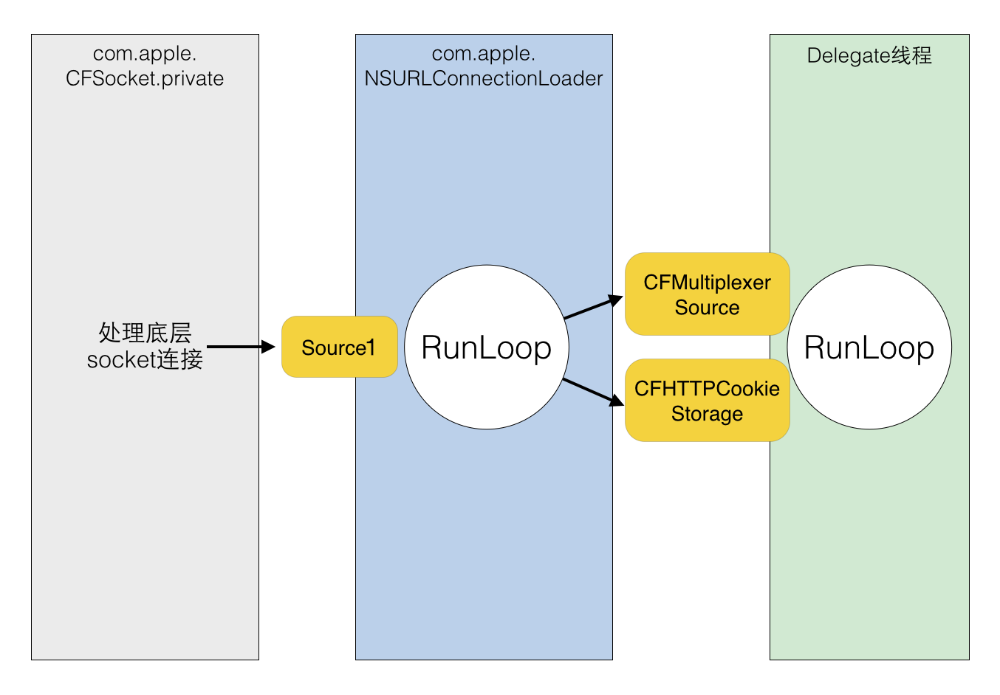

# Runloop理解
Runloop 是和线程紧密相关的一个基础组件，是很多线程有关功能的幕后功臣。尽管在平常使用中几乎不太会直接用到，理解 Runloop 有利于我们更加深入地理解 iOS 的多线程模型。

## Runloop基本概念
Runloop 是什么？Runloop 还是比较顾名思义的一个东西，说白了就是一种循环，只不过它这种循环比较高级。一般的 while 循环会导致 CPU 进入忙等待状态，而 Runloop 则是一种“闲”等待，这部分可以类比 Linux 下的 epoll。当没有事件时，Runloop 会进入休眠状态，有事件发生时， Runloop 会去找对应的 Handler 处理事件。Runloop 可以让线程在需要做事的时候忙起来，不需要的话就让线程休眠。


图中展现了 Runloop 在线程中的作用：从 input source 和 timer source 接受事件，然后在线程中处理事件。
日常开发中和runloop相关的知识：

* AutoreleasePool
* NSTimer
* 消息通知
* perform函数
* dispatch调用
* block回调
* KVO
* 触摸事件以及各种硬件传感器

### RunLoop 的概念
一般来讲，一个线程一次只能执行一个任务，执行完成后线程就会退出。如果我们需要一个机制，让线程能随时处理事件但并不退出，通常的代码逻辑是这样的：

```
function loop() {
    initialize();
    do {
        var message = get_next_message();
        process_message(message);
    } while (message != quit);
}
```
这种模型通常被称作 Event Loop。 Event Loop 在很多系统和框架里都有实现，比如 Node.js 的事件处理，比如 Windows 程序的消息循环，再比如 OSX/iOS 里的 RunLoop。实现这种模型的关键点在于：如何管理事件/消息，如何让线程在没有处理消息时休眠以避免资源占用、在有消息到来时立刻被唤醒。

所以，RunLoop 实际上就是一个对象，这个对象管理了其需要处理的事件和消息，并提供了一个入口函数来执行上面 Event Loop 的逻辑。线程执行了这个函数后，就会一直处于这个函数内部 “接受消息->等待->处理” 的循环中，直到这个循环结束（比如传入 quit 的消息），函数返回。

OSX/iOS 系统中，提供了两个这样的对象：NSRunLoop 和 CFRunLoopRef。
CFRunLoopRef 是在 CoreFoundation 框架内的，它提供了纯 C 函数的 API，所有这些 API 都是线程安全的。
NSRunLoop 是基于 CFRunLoopRef 的封装，提供了面向对象的 API，但是这些 API 不是线程安全的。

CFRunLoopRef 的代码是开源的，你可以在这里 http://opensource.apple.com/tarballs/CF/ 下载到整个 CoreFoundation 的源码来查看。


### RunLoop 与线程的关系
首先，iOS 开发中能遇到两个线程对象: pthread_t 和 NSThread。过去苹果有份文档标明了 NSThread 只是 pthread_t 的封装，但那份文档已经失效了，现在它们也有可能都是直接包装自最底层的 mach thread。苹果并没有提供这两个对象相互转换的接口，但不管怎么样，可以肯定的是 pthread_t 和 NSThread 是一一对应的。比如，你可以通过 pthread_main_thread_np() 或 [NSThread mainThread] 来获取主线程；也可以通过 pthread_self() 或 [NSThread currentThread] 来获取当前线程。CFRunLoop 是基于 pthread 来管理的。

苹果不允许直接创建 RunLoop，它只提供了两个自动获取的函数：CFRunLoopGetMain() 和 CFRunLoopGetCurrent()。 这两个函数内部的逻辑大概是下面这样:

```
/// 全局的Dictionary，key 是 pthread_t， value 是 CFRunLoopRef
static CFMutableDictionaryRef loopsDic;
/// 访问 loopsDic 时的锁
static CFSpinLock_t loopsLock;
 
/// 获取一个 pthread 对应的 RunLoop。
CFRunLoopRef _CFRunLoopGet(pthread_t thread) {
    OSSpinLockLock(&loopsLock);
    
    if (!loopsDic) {
        // 第一次进入时，初始化全局Dic，并先为主线程创建一个 RunLoop。
        loopsDic = CFDictionaryCreateMutable();
        CFRunLoopRef mainLoop = _CFRunLoopCreate();
        CFDictionarySetValue(loopsDic, pthread_main_thread_np(), mainLoop);
    }
    
    /// 直接从 Dictionary 里获取。
    CFRunLoopRef loop = CFDictionaryGetValue(loopsDic, thread));
    
    if (!loop) {
        /// 取不到时，创建一个
        loop = _CFRunLoopCreate();
        CFDictionarySetValue(loopsDic, thread, loop);
        /// 注册一个回调，当线程销毁时，顺便也销毁其对应的 RunLoop。
        _CFSetTSD(..., thread, loop, __CFFinalizeRunLoop);
    }
    
    OSSpinLockUnLock(&loopsLock);
    return loop;
}
 
CFRunLoopRef CFRunLoopGetMain() {
    return _CFRunLoopGet(pthread_main_thread_np());
}
 
CFRunLoopRef CFRunLoopGetCurrent() {
    return _CFRunLoopGet(pthread_self());
}
```
从上面的代码可以看出，线程和 RunLoop 之间是一一对应的，其关系是保存在一个全局的 Dictionary 里。`线程刚创建时并没有 RunLoop，如果你不主动获取，那它一直都不会有。`RunLoop 的创建是发生在第一次获取时，RunLoop 的销毁是发生在线程结束时。你只能在一个线程的内部获取其 RunLoop（主线程除外）。

### RunLoop 对外的接口
在 CoreFoundation 里面关于 RunLoop 有5个类:

* CFRunLoopRef
* CFRunLoopModeRef
* CFRunLoopSourceRef
* CFRunLoopTimerRef
* CFRunLoopObserverRef

其中 CFRunLoopModeRef 类并没有对外暴露，只是通过 CFRunLoopRef 的接口进行了封装。他们的关系如下:


一个 RunLoop 包含若干个 Mode，每个 Mode 又包含若干个 Source/Timer/Observer。每次调用 RunLoop 的主函数时，只能指定其中一个 Mode，这个Mode被称作 CurrentMode。如果需要切换 Mode，只能退出 Loop，再重新指定一个 Mode 进入。这样做主要是为了分隔开不同组的 Source/Timer/Observer，让其互不影响。

**CFRunLoopSourceRef** 是事件产生的地方。Source有两个版本：Source0 和 Source1。

* Source0 只包含了一个回调（函数指针），它并不能主动触发事件。使用时，你需要先调用 CFRunLoopSourceSignal(source)，将这个 Source 标记为待处理，然后手动调用 CFRunLoopWakeUp(runloop) 来唤醒 RunLoop，让其处理这个事件。
* Source1 包含了一个 mach_port 和一个回调（函数指针），被用于通过内核和其他线程相互发送消息。这种 Source 能主动唤醒 RunLoop 的线程，其原理在下面会讲到。

**CFRunLoopTimerRef** 是基于时间的触发器，它和 NSTimer 是toll-free bridged 的，可以混用。其包含一个时间长度和一个回调（函数指针）。当其加入到 RunLoop 时，RunLoop会注册对应的时间点，当时间点到时，RunLoop会被唤醒以执行那个回调。

**CFRunLoopObserverRef** 是观察者，每个 Observer 都包含了一个回调（函数指针），当 RunLoop 的状态发生变化时，观察者就能通过回调接受到这个变化。可以观测的时间点有以下几个：

```
typedef CF_OPTIONS(CFOptionFlags, CFRunLoopActivity) {
    kCFRunLoopEntry         = (1UL << 0), // 即将进入Loop
    kCFRunLoopBeforeTimers  = (1UL << 1), // 即将处理 Timer
    kCFRunLoopBeforeSources = (1UL << 2), // 即将处理 Source
    kCFRunLoopBeforeWaiting = (1UL << 5), // 即将进入休眠
    kCFRunLoopAfterWaiting  = (1UL << 6), // 刚从休眠中唤醒
    kCFRunLoopExit          = (1UL << 7), // 即将退出Loop
};
```
上面的 Source/Timer/Observer 被统称为 **mode item**，一个 item 可以被同时加入多个 mode。但一个 item 被重复加入同一个 mode 时是不会有效果的。如果一个 mode 中一个 item 都没有，则 RunLoop 会直接退出，不进入循环。

### RunLoop 的 Mode
CFRunLoopMode 和 CFRunLoop 的结构大致如下：

```
struct __CFRunLoopMode {
    CFStringRef _name;            // Mode Name, 例如 @"kCFRunLoopDefaultMode"
    CFMutableSetRef _sources0;    // Set
    CFMutableSetRef _sources1;    // Set
    CFMutableArrayRef _observers; // Array
    CFMutableArrayRef _timers;    // Array
    ...
};
 
struct __CFRunLoop {
    CFMutableSetRef _commonModes;     // Set
    CFMutableSetRef _commonModeItems; // Set<Source/Observer/Timer>
    CFRunLoopModeRef _currentMode;    // Current Runloop Mode
    CFMutableSetRef _modes;           // Set
    ...
};
```
这里有个概念叫 “CommonModes”：一个 Mode 可以将自己标记为”Common”属性（通过将其 ModeName 添加到 RunLoop 的 “commonModes” 中）。每当 RunLoop 的内容发生变化时，RunLoop 都会自动将 _commonModeItems 里的 Source/Observer/Timer 同步到具有 “Common” 标记的所有Mode里。

应用场景举例：主线程的 RunLoop 里有两个预置的 Mode：kCFRunLoopDefaultMode 和 UITrackingRunLoopMode。这两个 Mode 都已经被标记为”Common”属性。DefaultMode 是 App 平时所处的状态，TrackingRunLoopMode 是追踪 ScrollView 滑动时的状态。当你创建一个 Timer 并加到 DefaultMode 时，Timer 会得到重复回调，但此时滑动一个TableView时，RunLoop 会将 mode 切换为 TrackingRunLoopMode，这时 Timer 就不会被回调，并且也不会影响到滑动操作。

有时你需要一个 Timer，在两个 Mode 中都能得到回调，一种办法就是将这个 Timer 分别加入这两个 Mode。还有一种方式，就是将 Timer 加入到顶层的 RunLoop 的 “commonModeItems” 中。”commonModeItems” 被 RunLoop 自动更新到所有具有”Common”属性的 Mode 里去。

CFRunLoop对外暴露的管理 Mode 接口只有下面2个:

```
CFRunLoopAddCommonMode(CFRunLoopRef runloop, CFStringRef modeName);
CFRunLoopRunInMode(CFStringRef modeName, ...);
```
Mode 暴露的管理 mode item 的接口有下面几个：

```
CFRunLoopAddSource(CFRunLoopRef rl, CFRunLoopSourceRef source, CFStringRef modeName);
CFRunLoopAddObserver(CFRunLoopRef rl, CFRunLoopObserverRef observer, CFStringRef modeName);
CFRunLoopAddTimer(CFRunLoopRef rl, CFRunLoopTimerRef timer, CFStringRef mode);
CFRunLoopRemoveSource(CFRunLoopRef rl, CFRunLoopSourceRef source, CFStringRef modeName);
CFRunLoopRemoveObserver(CFRunLoopRef rl, CFRunLoopObserverRef observer, CFStringRef modeName);
CFRunLoopRemoveTimer(CFRunLoopRef rl, CFRunLoopTimerRef timer, CFStringRef mode);
```
你只能通过 mode name 来操作内部的 mode，当你传入一个新的 mode name 但 RunLoop 内部没有对应 mode 时，RunLoop会自动帮你创建对应的 CFRunLoopModeRef。对于一个 RunLoop 来说，其内部的 mode 只能增加不能删除。

苹果公开提供的 Mode 有两个：kCFRunLoopDefaultMode (NSDefaultRunLoopMode) 和 UITrackingRunLoopMode，你可以用这两个 Mode Name 来操作其对应的 Mode。

同时苹果还提供了一个操作 Common 标记的字符串：kCFRunLoopCommonModes (**NSRunLoopCommonModes**)，你可以用这个字符串来操作 Common Items，或标记一个 Mode 为 “Common”。使用时注意区分这个字符串和其他 mode name。

### RunLoop 的内部逻辑
根据苹果在文档里的说明，RunLoop 内部的逻辑大致如下:


实际上 RunLoop 就是这样一个函数，其内部是一个 do-while 循环。当你调用 CFRunLoopRun() 时，线程就会一直停留在这个循环里；直到超时或被手动停止，该函数才会返回。

### 苹果用 RunLoop 实现的功能
首先我们可以看一下 App 启动后 RunLoop 的状态：

```
CFRunLoop {
    current mode = kCFRunLoopDefaultMode
    common modes = {
        UITrackingRunLoopMode
        kCFRunLoopDefaultMode
    }
 
    common mode items = {
 
        // source0 (manual)
        CFRunLoopSource {order =-1, {
            callout = _UIApplicationHandleEventQueue}}
        CFRunLoopSource {order =-1, {
            callout = PurpleEventSignalCallback }}
        CFRunLoopSource {order = 0, {
            callout = FBSSerialQueueRunLoopSourceHandler}}
 
        // source1 (mach port)
        CFRunLoopSource {order = 0,  {port = 17923}}
        CFRunLoopSource {order = 0,  {port = 12039}}
        CFRunLoopSource {order = 0,  {port = 16647}}
        CFRunLoopSource {order =-1, {
            callout = PurpleEventCallback}}
        CFRunLoopSource {order = 0, {port = 2407,
            callout = _ZL20notify_port_callbackP12__CFMachPortPvlS1_}}
        CFRunLoopSource {order = 0, {port = 1c03,
            callout = __IOHIDEventSystemClientAvailabilityCallback}}
        CFRunLoopSource {order = 0, {port = 1b03,
            callout = __IOHIDEventSystemClientQueueCallback}}
        CFRunLoopSource {order = 1, {port = 1903,
            callout = __IOMIGMachPortPortCallback}}
 
        // Ovserver
        CFRunLoopObserver {order = -2147483647, activities = 0x1, // Entry
            callout = _wrapRunLoopWithAutoreleasePoolHandler}
        CFRunLoopObserver {order = 0, activities = 0x20,          // BeforeWaiting
            callout = _UIGestureRecognizerUpdateObserver}
        CFRunLoopObserver {order = 1999000, activities = 0xa0,    // BeforeWaiting | Exit
            callout = _afterCACommitHandler}
        CFRunLoopObserver {order = 2000000, activities = 0xa0,    // BeforeWaiting | Exit
            callout = _ZN2CA11Transaction17observer_callbackEP19__CFRunLoopObservermPv}
        CFRunLoopObserver {order = 2147483647, activities = 0xa0, // BeforeWaiting | Exit
            callout = _wrapRunLoopWithAutoreleasePoolHandler}
 
        // Timer
        CFRunLoopTimer {firing = No, interval = 3.1536e+09, tolerance = 0,
            next fire date = 453098071 (-4421.76019 @ 96223387169499),
            callout = _ZN2CAL14timer_callbackEP16__CFRunLoopTimerPv (QuartzCore.framework)}
    },
 
    modes ＝ {
        CFRunLoopMode  {
            sources0 =  { /* same as 'common mode items' */ },
            sources1 =  { /* same as 'common mode items' */ },
            observers = { /* same as 'common mode items' */ },
            timers =    { /* same as 'common mode items' */ },
        },
 
        CFRunLoopMode  {
            sources0 =  { /* same as 'common mode items' */ },
            sources1 =  { /* same as 'common mode items' */ },
            observers = { /* same as 'common mode items' */ },
            timers =    { /* same as 'common mode items' */ },
        },
 
        CFRunLoopMode  {
            sources0 = {
                CFRunLoopSource {order = 0, {
                    callout = FBSSerialQueueRunLoopSourceHandler}}
            },
            sources1 = (null),
            observers = {
                CFRunLoopObserver >{activities = 0xa0, order = 2000000,
                    callout = _ZN2CA11Transaction17observer_callbackEP19__CFRunLoopObservermPv}
            )},
            timers = (null),
        },
 
        CFRunLoopMode  {
            sources0 = {
                CFRunLoopSource {order = -1, {
                    callout = PurpleEventSignalCallback}}
            },
            sources1 = {
                CFRunLoopSource {order = -1, {
                    callout = PurpleEventCallback}}
            },
            observers = (null),
            timers = (null),
        },
        
        CFRunLoopMode  {
            sources0 = (null),
            sources1 = (null),
            observers = (null),
            timers = (null),
        }
    }
}
```
可以看到，系统默认注册了5个Mode:
1. kCFRunLoopDefaultMode: App的默认 Mode，通常主线程是在这个 Mode 下运行的。
2. UITrackingRunLoopMode: 界面跟踪 Mode，用于 ScrollView 追踪触摸滑动，保证界面滑动时不受其他 Mode 影响。
3. UIInitializationRunLoopMode: 在刚启动 App 时第进入的第一个 Mode，启动完成后就不再使用。
4. GSEventReceiveRunLoopMode: 接受系统事件的内部 Mode，通常用不到。
5. kCFRunLoopCommonModes: 这是一个占位的 Mode，没有实际作用。

#### AutoreleasePool
App启动后，苹果在主线程 RunLoop 里注册了两个 Observer，其回调都是 _wrapRunLoopWithAutoreleasePoolHandler()。

第一个 Observer 监视的事件是 Entry(即将进入Loop)，其回调内会调用 _objc_autoreleasePoolPush() 创建自动释放池。其 order 是-2147483647，优先级最高，保证创建释放池发生在其他所有回调之前。

第二个 Observer 监视了两个事件： BeforeWaiting(准备进入休眠) 时调用_objc_autoreleasePoolPop() 和 _objc_autoreleasePoolPush() 释放旧的池并创建新池；Exit(即将退出Loop) 时调用 _objc_autoreleasePoolPop() 来释放自动释放池。这个 Observer 的 order 是 2147483647，优先级最低，保证其释放池子发生在其他所有回调之后。

在主线程执行的代码，通常是写在诸如事件回调、Timer回调内的。这些回调会被 RunLoop 创建好的 AutoreleasePool 环绕着，所以不会出现内存泄漏，开发者也不必显示创建 Pool 了。

#### 事件响应
苹果注册了一个 Source1 (基于 mach port 的) 用来接收系统事件，其回调函数为 __IOHIDEventSystemClientQueueCallback()。

当一个硬件事件(触摸/锁屏/摇晃等)发生后，首先由 IOKit.framework 生成一个 IOHIDEvent 事件并由 SpringBoard 接收。这个过程的详细情况可以参考[这里](http://iphonedevwiki.net/index.php/IOHIDFamily)。SpringBoard 只接收按键(锁屏/静音等)，触摸，加速，接近传感器等几种 Event，随后用 mach port 转发给需要的App进程。随后苹果注册的那个 Source1 就会触发回调，并调用 _UIApplicationHandleEventQueue() 进行应用内部的分发。

_UIApplicationHandleEventQueue() 会把 IOHIDEvent 处理并包装成 UIEvent 进行处理或分发，其中包括识别 UIGesture/处理屏幕旋转/发送给 UIWindow 等。通常事件比如 UIButton 点击、touchesBegin/Move/End/Cancel 事件都是在这个回调中完成的。

#### 手势识别
当上面的 _UIApplicationHandleEventQueue() 识别了一个手势时，其首先会调用 Cancel 将当前的 touchesBegin/Move/End 系列回调打断。随后系统将对应的 UIGestureRecognizer 标记为待处理。

苹果注册了一个 Observer 监测 BeforeWaiting (Loop即将进入休眠) 事件，这个Observer的回调函数是 _UIGestureRecognizerUpdateObserver()，其内部会获取所有刚被标记为待处理的 GestureRecognizer，并执行GestureRecognizer的回调。

当有 UIGestureRecognizer 的变化(创建/销毁/状态改变)时，这个回调都会进行相应处理。

#### 界面更新
当在操作 UI 时，比如改变了 Frame、更新了 UIView/CALayer 的层次时，或者手动调用了 UIView/CALayer 的 setNeedsLayout/setNeedsDisplay方法后，这个 UIView/CALayer 就被标记为待处理，并被提交到一个全局的容器去。

苹果注册了一个 Observer 监听 BeforeWaiting(即将进入休眠) 和 Exit (即将退出Loop) 事件，回调去执行一个很长的函数：
_ZN2CA11Transaction17observer_callbackEP19__CFRunLoopObservermPv()。这个函数里会遍历所有待处理的 UIView/CAlayer 以执行实际的绘制和调整，并更新 UI 界面。

这个函数内部的调用栈大概是这样的：

```
_ZN2CA11Transaction17observer_callbackEP19__CFRunLoopObservermPv()
    QuartzCore:CA::Transaction::observer_callback:
        CA::Transaction::commit();
            CA::Context::commit_transaction();
                CA::Layer::layout_and_display_if_needed();
                    CA::Layer::layout_if_needed();
                        [CALayer layoutSublayers];
                            [UIView layoutSubviews];
                    CA::Layer::display_if_needed();
                        [CALayer display];
                            [UIView drawRect];
```

#### 定时器
NSTimer 其实就是 CFRunLoopTimerRef，他们之间是 toll-free bridged 的。一个 NSTimer 注册到 RunLoop 后，RunLoop 会为其重复的时间点注册好事件。例如 10:00, 10:10, 10:20 这几个时间点。RunLoop为了节省资源，并不会在非常准确的时间点回调这个Timer。Timer 有个属性叫做 Tolerance (宽容度)，标示了当时间点到后，容许有多少最大误差。

如果某个时间点被错过了，例如执行了一个很长的任务，则那个时间点的回调也会跳过去，不会延后执行。就比如等公交，如果 10:10 时我忙着玩手机错过了那个点的公交，那我只能等 10:20 这一趟了。

CADisplayLink 是一个和屏幕刷新率一致的定时器（但实际实现原理更复杂，和 NSTimer 并不一样，其内部实际是操作了一个 Source）。如果在两次屏幕刷新之间执行了一个长任务，那其中就会有一帧被跳过去（和 NSTimer 相似），造成界面卡顿的感觉。在快速滑动TableView时，即使一帧的卡顿也会让用户有所察觉。Facebook 开源的 AsyncDisplayLink 就是为了解决界面卡顿的问题，其内部也用到了 RunLoop。

#### PerformSelecter
当调用 NSObject 的 performSelecter:afterDelay: 后，实际上其内部会创建一个 Timer 并添加到当前线程的 RunLoop 中。所以如果当前线程没有 RunLoop，则这个方法会失效。

当调用 performSelector:onThread: 时，实际上其会创建一个 Timer 加到对应的线程去，同样的，如果对应线程没有 RunLoop 该方法也会失效。

#### 关于GCD
实际上 RunLoop 底层也会用到 GCD 的东西，~~比如 RunLoop 是用 dispatch_source_t 实现的 Timer~~（评论中有人提醒，NSTimer 是用了 XNU 内核的 mk_timer，我也仔细调试了一下，发现 NSTimer 确实是由 mk_timer 驱动，而非 GCD 驱动的）。但同时 GCD 提供的某些接口也用到了 RunLoop， 例如 dispatch_async()。

当调用 dispatch_async(dispatch_get_main_queue(), block) 时，libDispatch 会向主线程的 RunLoop 发送消息，RunLoop会被唤醒，并从消息中取得这个 block，并在回调 __CFRUNLOOP_IS_SERVICING_THE_MAIN_DISPATCH_QUEUE__() 里执行这个 block。但这个逻辑仅限于 dispatch 到主线程，dispatch 到其他线程仍然是由 libDispatch 处理的。

#### 关于网络请求
iOS 中，关于网络请求的接口自下至上有如下几层:

```
CFSocket
CFNetwork       ->ASIHttpRequest
NSURLConnection ->AFNetworking
NSURLSession    ->AFNetworking2, Alamofire
```

* CFSocket 是最底层的接口，只负责 socket 通信。
* CFNetwork 是基于 CFSocket 等接口的上层封装，ASIHttpRequest 工作于这一层。
* NSURLConnection 是基于 CFNetwork 的更高层的封装，提供面向对象的接口，AFNetworking 工作于这一层。
* NSURLSession 是 iOS7 中新增的接口，表面上是和 NSURLConnection 并列的，但底层仍然用到了 NSURLConnection 的部分功能 (比如 com.apple.NSURLConnectionLoader 线程)，AFNetworking2 和 Alamofire 工作于这一层。

下面主要介绍下 NSURLConnection 的工作过程。

通常使用 NSURLConnection 时，你会传入一个 Delegate，当调用了 [connection start] 后，这个 Delegate 就会不停收到事件回调。实际上，start 这个函数的内部会会获取 CurrentRunLoop，然后在其中的 DefaultMode 添加了4个 Source0 (即需要手动触发的Source)。CFMultiplexerSource 是负责各种 Delegate 回调的，CFHTTPCookieStorage 是处理各种 Cookie 的。

当开始网络传输时，我们可以看到 NSURLConnection 创建了两个新线程：com.apple.NSURLConnectionLoader 和 com.apple.CFSocket.private。其中 CFSocket 线程是处理底层 socket 连接的。NSURLConnectionLoader 这个线程内部会使用 RunLoop 来接收底层 socket 的事件，并通过之前添加的 Source0 通知到上层的 Delegate。


NSURLConnectionLoader 中的 RunLoop 通过一些基于 mach port 的 Source 接收来自底层 CFSocket 的通知。当收到通知后，其会在合适的时机向 CFMultiplexerSource 等 Source0 发送通知，同时唤醒 Delegate 线程的 RunLoop 来让其处理这些通知。CFMultiplexerSource 会在 Delegate 线程的 RunLoop 对 Delegate 执行实际的回调。

### RunLoop 的实际应用举例
#### AFNetworking
AFURLConnectionOperation 这个类是基于 NSURLConnection 构建的，其希望能在后台线程接收 Delegate 回调。为此 AFNetworking 单独创建了一个线程，并在这个线程中启动了一个 RunLoop：

```
+ (void)networkRequestThreadEntryPoint:(id)__unused object {
    @autoreleasepool {
        [[NSThread currentThread] setName:@"AFNetworking"];
        NSRunLoop *runLoop = [NSRunLoop currentRunLoop];
        [runLoop addPort:[NSMachPort port] forMode:NSDefaultRunLoopMode];
        [runLoop run];
    }
}
 
+ (NSThread *)networkRequestThread {
    static NSThread *_networkRequestThread = nil;
    static dispatch_once_t oncePredicate;
    dispatch_once(&oncePredicate, ^{
        _networkRequestThread = [[NSThread alloc] initWithTarget:self selector:@selector(networkRequestThreadEntryPoint:) object:nil];
        [_networkRequestThread start];
    });
    return _networkRequestThread;
}
```
RunLoop 启动前内部必须要有至少一个 Timer/Observer/Source，所以 AFNetworking 在 [runLoop run] 之前先创建了一个新的 NSMachPort 添加进去了。通常情况下，调用者需要持有这个 NSMachPort (mach_port) 并在外部线程通过这个 port 发送消息到 loop 内；但此处添加 port 只是为了让 RunLoop 不至于退出，并没有用于实际的发送消息。

```
- (void)start {
    [self.lock lock];
    if ([self isCancelled]) {
        [self performSelector:@selector(cancelConnection) onThread:[[self class] networkRequestThread] withObject:nil waitUntilDone:NO modes:[self.runLoopModes allObjects]];
    } else if ([self isReady]) {
        self.state = AFOperationExecutingState;
        [self performSelector:@selector(operationDidStart) onThread:[[self class] networkRequestThread] withObject:nil waitUntilDone:NO modes:[self.runLoopModes allObjects]];
    }
    [self.lock unlock];
}
```
当需要这个后台线程执行任务时，AFNetworking 通过调用 [NSObject performSelector:onThread:..] 将这个任务扔到了后台线程的 RunLoop 中。

#### AsyncDisplayKit
[AsyncDisplayKit](https://github.com/facebook/AsyncDisplayKit)是 Facebook 推出的用于保持界面流畅性的框架，其原理大致如下：

UI 线程中一旦出现繁重的任务就会导致界面卡顿，这类任务通常分为3类：排版，绘制，UI对象操作。

排版通常包括计算视图大小、计算文本高度、重新计算子式图的排版等操作。
绘制一般有文本绘制 (例如 CoreText)、图片绘制 (例如预先解压)、元素绘制 (Quartz)等操作。
UI对象操作通常包括 UIView/CALayer 等 UI 对象的创建、设置属性和销毁。

其中前两类操作可以通过各种方法扔到后台线程执行，而最后一类操作只能在主线程完成，并且有时后面的操作需要依赖前面操作的结果 （例如TextView创建时可能需要提前计算出文本的大小）。ASDK 所做的，就是尽量将能放入后台的任务放入后台，不能的则尽量推迟 (例如视图的创建、属性的调整)。

为此，ASDK 创建了一个名为 ASDisplayNode 的对象，并在内部封装了 UIView/CALayer，它具有和 UIView/CALayer 相似的属性，例如 frame、backgroundColor等。所有这些属性都可以在后台线程更改，开发者可以只通过 Node 来操作其内部的 UIView/CALayer，这样就可以将排版和绘制放入了后台线程。但是无论怎么操作，这些属性总需要在某个时刻同步到主线程的 UIView/CALayer 去。

ASDK 仿照 QuartzCore/UIKit 框架的模式，实现了一套类似的界面更新的机制：即在主线程的 RunLoop 中添加一个 Observer，监听了 kCFRunLoopBeforeWaiting 和 kCFRunLoopExit 事件，在收到回调时，遍历所有之前放入队列的待处理的任务，然后一一执行。
具体的代码可以看这里：_ASAsyncTransactionGroup。

#### NStimer在ScrollView上运行
我们在平时开发中一个很常见的现象：
`在界面上有一个UIscrollview控件（tableview，collectionview等），如果此时还有一个定时器在执行一个事件，你会发现当你滚动scrollview的时候，定时器会失效。`

这是因为，为了更好的用户体验，在主线程中UITrackingRunLoopMode的优先级最高。在用户拖动控件时，主线程的Run Loop是运行在UITrackingRunLoopMode下，而创建的Timer是默认关联为Default Mode，因此系统不会立即执行Default Mode下接收的事件。

解决方法1：
将当前 Timer 加入到 UITrackingRunLoopMode 或 kCFRunLoopCommonModes 中：

```Objective-C
NSTimer * timer = [NSTimer scheduledTimerWithTimeInterval:1.0 target:self selector:@selector(TimerFire:) userInfo:nil repeats:YES];
[[NSRunLoop mainRunLoop] addTimer:timer forMode:NSRunLoopCommonModes];  
// 或 [[NSRunLoop currentRunLoop] addTimer:timer forMode:UITrackingRunLoopMode];
[timer fire];
```
解决方法2： 因为GCD创建的定时器不受RunLoop的影响，可以使用GCD创建的定时器：

```Objective-C
//dispatch_source_t必须是全局或static变量，否则timer不会触发
static dispatch_source_t timer;
//创建新的调度源（这里传入的是DISPATCH_SOURCE_TYPE_TIMER，创建的是Timer调度
timer = dispatch_source_create(DISPATCH_SOURCE_TYPE_TIMER, 0, 0, dispatch_get_main_queue());
dispatch_source_set_timer(timer, DISPATCH_TIME_NOW, 1 * NSEC_PER_SEC, 0 * NSEC_PER_SEC);
dispatch_source_set_event_handler(timer, ^{
    NSLog(@"%@",[NSThread currentThread]);
});
//启动或继续定时器
dispatch_resume(timer);
```


