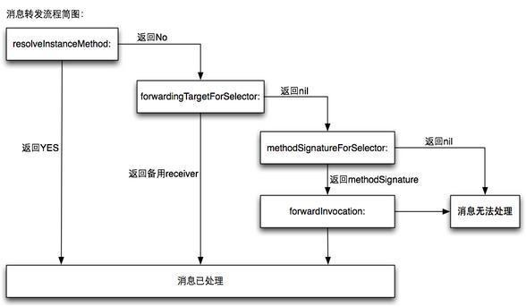

# Runtime整理
## Runtime简介
Runtime简称运行时。OC就是运行时机制，也就是在运行时候的一些机制，其中最主要的是消息机制。
* 对于C语言，函数的调用在编译的时候会决定调用哪个函数。
* 对于OC的函数，属于动态调用过程，在编译的时候并不能决定真正调用哪个函数，只有在真正运行的时候才会根据函数的名称找到对应的函数来调用。
* 事实证明：
    * 在编译阶段，OC可以调用任何函数，即使这个函数并未实现，只要声明过就不会报错。
    * 在编译阶段，C语言调用未实现的函数就会报错。
* 如果向某个对象传递消息，在底层，所有的方法都是普通的C语言函数，然而对象收到消息之后，究竟该调用哪个方法则完全取决于运行期决定，甚至可能在运行期改变，这些特性使得Objective-C变成一门真正的动态语言。
* 在Runtime中，对象可以用C语言中的结构体表示，而方法可以用C函数来实现，另外再加上了一些额外的特性。这些结构体和函数被Runtime函数封装后，让OC的面向对象编程变为可能。

## NSObject数据结构
如果你曾经对 ObjC 底层的实现有一定的了解，你应该会知道 Objective-C 对象都是 C 语言结构体，所有的对象都包含一个类型为 isa 的指针，那么你可能确实对 ObjC 的底层有所知，不过现在的 ObjC 对象的结构已经不是这样了。代替 isa 指针的是结构体 isa_t, 这个结构体中"包含"了当前对象指向的类的信息：

```Objective-C
struct objc_object {
    isa_t isa;
};
```
当 ObjC 为一个对象分配内存，初始化实例变量后，在这些对象的实例变量的结构体中的第一个就是 `isa`。


> 所有继承自 NSObject 的类实例化后的对象都会包含一个类型为 isa_t 的结构体。

从上图中可以看出，不只是**实例**会包含一个 isa 结构体，所有的**类对象**也有这么一个 isa。在 ObjC 中 Class 的定义也是一个名为 objc_class 的结构体，如下：

```Objective-C
struct objc_class : objc_object {
    isa_t isa;
    Class superclass;
    cache_t cache;
    class_data_bits_t bits;
};
```
> 由于 objc_class 结构体是继承自 objc_object 的，所以在这里显式地写出了 isa_t isa 这个成员变量。

### Class 类对象
Class对象也定义在Runtime的头文件中,查看objc/runtime.h中的objc_class结构体： Objective-C中,类是由Class类型来表示的，它实际上是一个指 向objc_class结构体的指针。

```Objective-C
struct objc_class {
    Class _Nonnull isa  OBJC_ISA_AVAILABILITY;

#if !__OBJC2__
    Class _Nullable super_class                              OBJC2_UNAVAILABLE;
    const char * _Nonnull name                               OBJC2_UNAVAILABLE;
    long version                                             OBJC2_UNAVAILABLE;
    long info                                                OBJC2_UNAVAILABLE;
    long instance_size                                       OBJC2_UNAVAILABLE;
    struct objc_ivar_list * _Nullable ivars                  OBJC2_UNAVAILABLE;
    struct objc_method_list * _Nullable * _Nullable methodLists                    OBJC2_UNAVAILABLE;
    struct objc_cache * _Nonnull cache                       OBJC2_UNAVAILABLE;
    struct objc_protocol_list * _Nullable protocols          OBJC2_UNAVAILABLE;
#endif

} OBJC2_UNAVAILABLE;
/* Use `Class` instead of `struct objc_class *` */
```
下面说下Class的结构体中的几个主要变量：
* isa： 结构体的首个变量也是isa指针，这说明Class本身也是Objective-C中的对象。isa指针非常重要, 对象需要通过isa指针找到它的类, 类需要通过isa找到它的元类. 这在调用实例方法和类方法的时候起到重要的作用.
* super_class： 结构体里还有个变量是super_class，它定义了本类的超类。类对象所属类型（isa指针所指向的类型）是另外一个类，叫做“元类”。
* ivars： 成员变量列表，类的成员变量都在ivars里面。
* methodLists：方法列表，类的实例方法都在methodLists里，类方法在元类的methodLists里面。methodLists是一个指针的指针，通过修改该指针指向指针的值，就可以动态的为某一个类添加成员方法。这也就是Category实现的原理，同时也说明了`Category只可以为对象添加成员方法，不能添加成员变量。`
* cache： 方法缓存列表，objc_msgSend（下文详解）每调用一次方法后，就会把该方法缓存到cache列表中，下次调用的时候，会优先从cache列表中寻找，如果cache没有，才从methodLists中查找方法。提高效率。

### 元类(Meta Class)
meta-class是一个类对象的类。
在上面我们提到，所有的类自身也是一个对象，我们可以向这个对象发送消息(即调用类方法)。既然是对象，那么它也是一个objc_object指针，它包含一个指向其类的一个isa指针。那么，这个isa指针指向什么呢？

为了调用类方法，这个类的isa指针必须指向一个包含这些类方法的一个objc_class结构体。这就引出了meta-class的概念，meta-class中存储着一个类的所有类方法。 所以，调用类方法的这个类对象的isa指针指向的就是meta-class。

当我们向一个对象发送消息时，runtime会在这个对象所属的这个类的方法列表中查找方法；而向一个类发送消息时，会在这个类的meta-class的方法列表中查找。再深入一下，meta-class也是一个类，也可以向它发送一个消息，那么它的isa又是指向什么呢？为了不让这种结构无限延伸下去，Objective-C的设计者让所有的meta-class的isa指向基类的meta-class，以此作为它们的所属类。

即，任何NSObject继承体系下的meta-class都使用NSObject的meta-class作为自己的所属类，而基类的meta-class的isa指针是指向它自己。

通过上面的描述，再加上对objc_class结构体中super_class指针的分析，我们就可以描绘出类及相应meta-class类的一个继承体系了，如下代码：


看图说话：
上图中：superclass指针代表继承关系，isa指针代表实例所属的类。
类也是一个对象，它是另外一个类的实例，这个就是“元类”，元类里面保存了类方法的列表，类里面保存了实例方法的列表。实例对象的isa指向类，类对象的isa指向元类，元类对象的isa指针指向一个“根元类”（root metaclass）。所有子类的元类都继承父类的元类，换而言之，类对象和元类对象有着同样的继承关系。

> 1.Class是一个指向objc_class结构体的指针，而id是一个指向objc_object结构体的指针，其中的isa是一个指向objc_class结构体的指针。其中的id就是我们所说的对象，Class就是我们所说的类。
2.isa指针不总是指向实例对象所属的类，不能依靠它来确定类型，而是应该用isKindOfClass:方法来确定实例对象的类。因为KVO的实现机制就是将被观察对象的isa指针指向一个中间类而不是真实的类。

### Category
Category是表示一个指向分类的结构体的指针，其定义如下：

```Objective-C
struct objc_category {
    char * _Nonnull category_name                            OBJC2_UNAVAILABLE;
    char * _Nonnull class_name                               OBJC2_UNAVAILABLE;
    struct objc_method_list * _Nullable instance_methods     OBJC2_UNAVAILABLE;
    struct objc_method_list * _Nullable class_methods        OBJC2_UNAVAILABLE;
    struct objc_protocol_list * _Nullable protocols          OBJC2_UNAVAILABLE;
} 
```
这个结构体主要包含了分类定义的实例方法与类方法，其中instance_methods列表是objc_class中方法列表的一个子集，而class_methods列表是元类方法列表的一个子集。
可发现，类别中没有ivar成员变量指针，也就意味着：**类别中不能够添加实例变量和属性**。

### SEL
SEL是选择子的类型，选择子指的就是方法的名字。在Runtime的头文件中的定义如下：

```Objective-C
typedef struct objc_selector *SEL;
```
#### 关于 @selector() 你需要知道的
因为在 Objective-C 中，所有的消息传递中的“消息“都会被转换成一个 selector 作为 objc_msgSend 函数的参数：

```Objective-C
[object hello] -> objc_msgSend(object, @selector(hello))
```
这里面使用 @selector(hello) 生成的选择子 **SEL** 是这一节中关注的重点。

我们需要预先解决的问题是：使用 @selector(hello) 生成的选择子，是否会因为类的不同而不同？各位读者可以自己思考一下。

先放出结论：使用 @selector() 生成的选择子不会因为类的不同而改变，其内存地址在编译期间就已经确定了。也就是说**向不同的类发送相同的消息时，其生成的选择子是完全相同的**。

推断出选择子有以下的特性：
1. Objective-C 为我们维护了一个巨大的选择子表。
2. 在使用 @selector() 时会从这个选择子表中根据选择子的名字查找对应的 SEL。如果没有找到，则会生成一个 SEL 并添加到表中。
3. 在编译期间会扫描全部的头文件和实现文件将其中的方法以及使用 @selector() 生成的选择子加入到选择子表中。

Objective-C在编译时，会依据每一个方法的名字、参数序列，生成一个**唯一的整型标识**(Int类型的地址)，这个标识就是SEL。
两个类之间，只要方法名相同，那么方法的SEL就是一样的，每一个方法都对应着一个SEL。所以在Objective-C同一个类(及类的继承体系)中，不能存在2个同名的方法，即使参数类型不同也不行
如在某一个类中定义以下两个方法: 错误。

```Objective-C
- (void)setWidth:(int)width;
- (void)setWidth:(double)width;
```
当然，不同的类可以拥有相同的selector，这个没有问题。不同类的实例对象执行相同的selector时，会在各自的方法列表中去根据selector去寻找自己对应的IMP。
`工程中的所有的SEL组成一个Set集合`，如果我们想到这个方法集合中查找某个方法时，只需要去找到这个方法对应的SEL就行了，**SEL实际上就是根据方法名hash化了的一个字符串，而对于字符串的比较仅仅需要比较他们的地址就可以了**，可以说速度上无语伦比！
本质上，SEL只是一个指向方法的指针（准确的说，只是一个根据方法名hash化了的KEY值，能唯一代表一个方法），它的存在只是为了加快方法的查询速度。
@selector()就是取类方法的编号，通过下面三种方法可以获取SEL:
* sel_registerName函数
* Objective-C编译器提供的@selector() 
* NSSelectorFromString()方法

### Method
Method代表类中的某个方法的类型，在Runtime的头文件中的定义如下：

```Objective-C
typedef struct objc_method *Method;
```
objc_method的结构体定义如下：

```Objective-C
struct objc_method{
    SEL method_name      OBJC2_UNAVAILABLE; // 方法名
    char *method_types   OBJC2_UNAVAILABLE;
    IMP method_imp       OBJC2_UNAVAILABLE; // 方法实现
}
```
1. method_name：方法名
2. method_types：方法类型，主要存储着方法的参数类型和返回值类型。
3. IMP：方法的实现，函数指针。class_copyMethodList(Class cls, unsigned int *outCount)可以使用这个方法获取某个类的成员方法列表。

### IMP
IMP在Runtime的头文件中的的定义如下：

```
typedef id (*IMP)(id, SEL, ...);
```
IMP是一个函数指针，它是由编译器生成的。当你发起一个消息后，这个函数指针决定了最终执行哪段代码。IMP实际上是一个函数指针，指向方法实现的地址。

第一个参数：是指向self的指针(如果是实例方法，则是类实例的内存地址；如果是类方法，则是指向元类的指针) 第二个参数：是方法选择器(selector) 接下来的参数：方法的参数列表。

前面介绍过的SEL就是为了查找方法的最终实现IMP的。由于每个方法对应唯一的SEL，因此我们可以通过SEL方便快速准确地获得它所对应的IMP，查找过程将在下面讨论。取得IMP后，我们就获得了执行这个方法代码的入口点，此时，我们就可以像调用普通的C语言函数一样来使用这个函数指针了。

## 发送消息（objc_msgSend）
在OC中，对象调用方法，最终都会调用底层objc_msgSend方法，用Objective-C的术语来说，这叫做“传递消息”（pass a message）。
objc_msgSend定义如下：

```Objective-C
id objc_msgSend(id self, SEL op, ...);
```
objc_msgSend发送消息的原理：
1. 检测这个selector是不是要被忽略的。
2. 检测这个target对象是不是nil对象。（nil对象执行任何一个方法都不会Crash，因为会被忽略掉）
3. 首先会根据target(objc_object)对象的isa指针获取它所对应的类（objc_class）。
4. 查看缓存中是否存在方法，系统把近期发送过的消息记录在其中，苹果认为这样可以提高效率: 优先在类（class）的cache里面查找是否有与选择子（selector）名称相符的方法。如果有，则找到objc_method中的IMP类型（函数指针）的成员method_imp去找到实现内容，并执行;如果缓存中没有命中，那么到该类的方法表(methodLists)查找该方法，依次从后往前查找。
5. 如果没有在类（class）找到，再到父类（super_class）查找，直至根类。
6. 一旦找到与选择子（selector）名称相符的方法，就跳至其实现代码。
7. 如果没有找到，就会执行消息转发（message forwarding）的第一步动态解析。

如果是**调用类方法**，objc_class中的isa指向该类的元类(metaclass)，那么就会利用objc_class中的成员isa找到元类(metaclass)，然后寻找方法，直至根metaclass,没有找到的话则仍然进入动态解析。

### 消息转发（message forwarding）
当一个对象能接收一个消息时，就会走正常的方法调用流程。但如果一个对象无法接收指定消息时，又会发生什么事呢？默认情况下，如果是以[object message]的方式调用方法，如果object无法响应message消息时，编译器会报错。但如果是以perform...的形式来调用，则需要等到运行时才能确定object是否能接收message消息。如果不能，则程序崩溃。

通常，当我们不能确定一个对象是否能接收某个消息时，会先调用respondsToSelector:来判断一下。如下代码所示：

```Objective-C
if ([self respondsToSelector:@selector(method)]) {
    [self performSelector:@selector(method)];
}
```
当一个对象无法接收某一消息时，就会启动所谓**消息转发(message forwarding)**机制，通过这一机制，我们可以告诉对象如何处理未知的消息。默认情况下，对象接收到未知的消息，会导致程序崩溃，通过控制台，我们可以看到以下异常信息：

```Objective-C
-[SUTRuntimeMethod method]: unrecognized selector sent to instance 0x100111940
*** Terminating app due to uncaught exception 'NSInvalidArgumentException', reason: '-[SUTRuntimeMethod method]: unrecognized selector sent to instance 0x100111940'
```

这段异常信息实际上是由NSObject的**doesNotRecognizeSelector**方法抛出的。不过，我们可以采取一些措施，让我们的程序执行特定的逻辑，而避免程序的崩溃。 消息转发机制基本上分为三个步骤：
1. 动态方法解析
2. 备用接收者
3. 完整转发

#### 动态方法解析
对象在接收到未知的消息时，首先会调用所属类的类方法+**resolveInstanceMethod**:(实例方法)或者+**resolveClassMethod**:(类方法)。在这个方法中，我们有机会为该未知消息新增一个”处理方法””。`不过使用该方法的前提是我们已经实现了该“处理方法”`，只需要在运行时通过class_addMethod函数动态添加到类里面就可以了。如下代码所示：

```Objective-C
void functionForMethod1(id self, SEL _cmd) {
   NSLog(@"%@, %p", self, _cmd);
}
	
+ (BOOL)resolveInstanceMethod:(SEL)sel {
    NSString *selectorString = NSStringFromSelector(sel);
    if ([selectorString isEqualToString:@"method1"]) {
        class_addMethod(self.class, @selector(method1), (IMP)functionForMethod1, "@:");
    }
    return [super resolveInstanceMethod:sel];
}
```

-------
class_addMethod方法可谓是核心，定义如下：

```Objective-C
BOOL class_addMethod(Class cls, SEL name, IMP imp, const char *types);
```
* cls，具体添加的类
* name，添加方法的选择子
* imp，添加方法的函数实现(IMP函数指针)
* types，IMP指针指向的函数返回值和参数类型，v代表无返回值void @代表id类型对象 ->self :代表选择子SEL->_cmd
    * "v@:" v代表无返回值void，如果是i则代表int 无参数
    * "i@:" 代表返回值是int类型，无参数
    * "v@:i@:" 代表返回值是void类型，参数是int类型，存在一个参数（多参数依次累加）"v@:@@" 代表 两个参数的没有返回值。

#### 备用接收者
如果在上一步无法处理消息，则Runtime会继续调以下方法：

```Objective-C
- (id)forwardingTargetForSelector:(SEL)aSelector;
```
如果一个对象实现了这个方法，并返回一个非nil的结果，则这个对象会作为消息的新接收者，且消息会被分发到这个对象。当然这个对象不能是self自身，否则就是出现无限循环。当然，如果我们没有指定相应的对象来处理aSelector，则应该调用父类的实现来返回结果。
使用这个方法通常是在对象内部，可能还有一系列其它对象能处理该消息，我们便可借这些对象来处理消息并返回，这样在对象外部看来，还是由该对象亲自处理了这一消息。如下代码所示：

```Objective-C
@interface SUTRuntimeMethodHelper : NSObject
- (void)method2;
@end
@implementation SUTRuntimeMethodHelper
- (void)method2 {
    NSLog(@"%@, %p", self, _cmd);
}
@end
#pragma mark -
@interface SUTRuntimeMethod () {
    SUTRuntimeMethodHelper *_helper;
}
@end
@implementation SUTRuntimeMethod
+ (instancetype)object {
    return [[self alloc] init];
}
- (instancetype)init {
    self = [super init];
    if (self != nil) {
        _helper = [[SUTRuntimeMethodHelper alloc] init];
    }
    return self;
}
- (void)test {
    [self performSelector:@selector(method2)];
}
- (id)forwardingTargetForSelector:(SEL)aSelector {
    NSLog(@"forwardingTargetForSelector");
    NSString *selectorString = NSStringFromSelector(aSelector);
    // 将消息转发给_helper来处理
    if ([selectorString isEqualToString:@"method2"]) {
        return _helper;
    }
    return [super forwardingTargetForSelector:aSelector];
}
@end
```
这一步合适于我们只想将消息转发到另一个能处理该消息的对象上。但这一步无法对消息进行处理，如操作消息的参数和返回值。

#### 完整消息转发
如果在上一步还不能处理未知消息，则唯一能做的就是启用完整的消息转发机制了。此时会调用以下方法：

```Objective-C
- (void)forwardInvocation:(NSInvocation *)anInvocation;
```
运行时系统会在这一步给消息接收者最后一次机会将消息转发给其它对象。对象会创建一个表示消息的NSInvocation对象，把与尚未处理的消息有关的全部细节都封装在anInvocation中，包括selector，目标(target)和参数。我们可以在forwardInvocation方法中选择将消息转发给其它对象。
forwardInvocation:方法的实现有两个任务：
1. 定位可以响应封装在anInvocation中的消息的对象。这个对象不需要能处理所有未知消息。
2. 使用anInvocation作为参数，将消息发送到选中的对象。anInvocation将会保留调用结果，运行时系统会提取这一结果并将其发送到消息的原始发送者。

不过，在这个方法中我们可以实现一些更复杂的功能，我们可以对消息的内容进行修改，比如追回一个参数等，然后再去触发消息。另外，若发现某个消息不应由本类处理，则应调用父类的同名方法，以便继承体系中的每个类都有机会处理此调用请求。
还有一个很重要的问题，我们必须重写以下方法：

```
- (NSMethodSignature *)methodSignatureForSelector:(SEL)aSelector;
```

消息转发机制使用从这个方法中获取的信息来创建NSInvocation对象。因此我们必须重写这个方法，为给定的selector提供一个合适的方法签名。 完整的示例如下所示：

```Objective-C
- (NSMethodSignature *)methodSignatureForSelector:(SEL)aSelector {
    NSMethodSignature *signature = [super methodSignatureForSelector:aSelector];
    if (!signature) {
        if ([SUTRuntimeMethodHelper instancesRespondToSelector:aSelector]) {
            signature = [SUTRuntimeMethodHelper instanceMethodSignatureForSelector:aSelector];
        }
    }
    return signature;
}
- (void)forwardInvocation:(NSInvocation *)anInvocation {
    if ([SUTRuntimeMethodHelper instancesRespondToSelector:anInvocation.selector]) {
        [anInvocation invokeWithTarget:_helper];
    }
}
```

NSObject的forwardInvocation:方法实现只是简单调用了doesNotRecognizeSelector:方法，它不会转发任何消息。这样，如果不在以上所述的三个步骤中处理未知消息，则会引发一个异常。
从某种意义上来讲，forwardInvocation:就像一个未知消息的分发中心，将这些未知的消息转发给其它对象。或者也可以像一个运输站一样将所有未知消息都发送给同一个接收对象。这取决于具体的实现。

### 消息转发步骤
* 第一步：对象在收到无法解读的消息后，首先调用resolveInstanceMethod：方法决定是否动态添加方法。如果返回YES，则调用class_addMethod动态添加方法，消息得到处理，结束；如果返回NO，则进入下一步；
* 第二步：当前接收者还有第二次机会处理未知的选择子，在这一步中，运行期系统会问：能不能把这条消息转给其他接收者来处理。会进入forwardingTargetForSelector:方法，用于指定备选对象响应这个selector，不能指定为self。如果返回某个对象则会调用对象的方法，结束。如果返回nil，则进入下一步；
* 第三步：这步我们要通过methodSignatureForSelector:方法签名，如果返回nil，则消息无法处理。如果返回methodSignature，则进入下一步；
* 第四步：这步调用forwardInvocation：方法，我们可以通过anInvocation对象做很多处理，比如修改实现方法，修改响应对象等，如果方法调用成功，则结束。如果失败，则进入doesNotRecognizeSelector方法，抛出异常，此异常表示选择子最终未能得到处理。



## 关联对象 AssociatedObject
我们在 iOS 开发中经常需要使用分类（Category），为已经存在的类添加属性的需求，但是使用 @property 并不能在分类中**正确**创建实例变量和存取方法。

不过，通过 Objective-C 运行时中的关联对象，也就是 Associated Object，我们可以实现上述需求。

Q：我们为什么要使用关联对象？

A：因为在分类中 @property 并不会自动生成实例变量以及存取方法，所以一般使用关联对象为已经存在的类添加『属性』。

上一小节的内容已经给了我们需要使用关联对象的理由。在这里，我们会介绍 ObjC 运行时为我们提供的与关联对象有关的 API，并在分类中实现一个**伪属性**：

```Objective-C
#import "DKObject+Category.h"
#import <objc/runtime.h>

@implementation DKObject (Category)

- (NSString *)categoryProperty {
    return objc_getAssociatedObject(self, _cmd);
}

- (void)setCategoryProperty:(NSString *)categoryProperty {
    objc_setAssociatedObject(self, @selector(categoryProperty), categoryProperty, OBJC_ASSOCIATION_RETAIN_NONATOMIC);
}

@end
```
> 这里的 _cmd 代指当前方法的选择子，也就是 @selector(categoryProperty)。

我们使用了两个方法 objc_getAssociatedObject 以及 objc_setAssociatedObject 来模拟『属性』的存取方法，而使用关联对象模拟实例变量。

```Objective-C
id objc_getAssociatedObject(id object, const void *key);
void objc_setAssociatedObject(id object, const void *key, id value, objc_AssociationPolicy policy);
```
@selector(categoryProperty) 也就是参数中的 key，其实可以使用静态指针 static void * 类型的参数来代替，不过在这里，笔者强烈推荐使用 @selector(categoryProperty) 作为 key 传入。因为这种方法省略了声明参数的代码，并且能很好地保证 key 的唯一性。

在分类中到底能否实现属性？其实在回答这个问题之前，首先要知道到底属性是什么？而属性的概念决定了这个问题的答案。
* 如果你把属性理解为**通过方法访问的实例变量**，我相信这个问题的答案是不能，因为分类不能为类增加额外的实例变量。
* 不过如果属性只是一个存**取方法以及存储值的容器的集合**，那么分类是可以实现属性的。

> 分类中对属性的实现其实只是实现了一个看起来像属性的接口而已

### 实现
具体参见[Objective-C Associated Objects 的实现原理](http://blog.leichunfeng.com/blog/2015/06/26/objective-c-associated-objects-implementation-principle/)
1. `AssociationsManager` 是顶级的对象，维护了一个从 `spinlock_t` 锁到 `AssociationsHashMap` 哈希表的单例键值对映射；
2. `AssociationsHashMap` 是一个无序的哈希表，维护了从对象地址到 `ObjectAssociationMap` 的映射；
3. `ObjectAssociationMap` 是一个 C++ 中的 map ，维护了从 key 到 `ObjcAssociation` 的映射，即关联记录；
4. `ObjcAssociation` 是一个 C++ 的类，表示一个具体的关联结构，主要包括两个实例变量，_policy 表示关联策略，_value 表示关联对象。

总结：
1. 关联对象与被关联对象本身的存储并没有直接的关系，它是存储在单独的哈希表中的。
2. 关联对象的五种关联策略与属性的限定符非常类似，在绝大多数情况下，我们都会使用 `OBJC_ASSOCIATION_RETAIN_NONATOMIC` 的关联策略，这可以保证我们持有关联对象。
3. 关联对象的释放时机与移除时机并不总是一致，比如实验中用关联策略 OBJC_ASSOCIATION_ASSIGN 进行关联的对象，很早就已经被释放了，但是并没有被移除，而再使用这个关联对象时就会造成 Crash 。

## 交换方法（method swizzing）
[Objective-C Method Swizzling 的最佳实践 by雷纯锋](http://blog.leichunfeng.com/blog/2015/06/14/objective-c-method-swizzling-best-practice/)
开发使用场景:系统自带的方法功能不够，给系统自带的方法扩展一些功能，并且保持原有的功能。
* 方式一:继承系统的类，重写方法。
* 方式二:使用runtime，交换方法。在Objective-C中，对象收到消息之后，究竟会调用哪种方法需要在运行期才能解析出来。查找消息的唯一依据是选择子(selector)，选择子(selector)与相应的方法(IMP)对应，利用Objective-C的动态特性，可以实现在运行时偷换选择子（selector）对应的方法实现，这就是方法交换（method swizzling）。每个类都有一个方法列表，存放着selector的名字和方法实现的映射关系。IMP有点类似函数指针，指向具体的Method实现。

Objective-C中提供了三种API来动态替换类方法或实例方法的实现：
* class_replaceMethod替换类方法的定义。
* method_exchangeImplementations交换两个方法的实现。
* method_setImplementation设置一个方法的实现

```Objective-C
class_replaceMethod(Class cls, SEL name, IMP imp, const char *types)
method_exchangeImplementations(Method m1, Method m2)
method_setImplementation(Method m, IMP imp)
```

三个方法的区别：
* class_replaceMethod：当类中没有想替换的原方法时，该方法调用class_addMethod来为该类增加一个新方法，也正因如此，class_replaceMethod在调用时需要传入types参数，而其余两个却不需要。
* method_exchangeImplementations：内部实现就是调用了两次method_setImplementation方法。


```Objective-C
+ (void)load
{
    static dispatch_once_t onceToken;
    dispatch_once(&onceToken, ^{

        SEL originalSelector = @selector(willMoveToSuperview:);
        SEL swizzledSelector = @selector(myWillMoveToSuperview:);

        Method originalMethod = class_getInstanceMethod(self, originalSelector);
        Method swizzledMethod = class_getInstanceMethod(self, swizzledSelector);
        
        BOOL didAddMethod = class_addMethod(self, 
                                            originalSelector,
                                            method_getImplementation(swizzledMethod),
                                            method_getTypeEncoding(swizzledMethod));

        if (didAddMethod) {
            class_replaceMethod(self, 
                                swizzledSelector, 
                                method_getImplementation(originalMethod),
                                method_getTypeEncoding(originalMethod));
        } else {
            method_exchangeImplementations(originalMethod, swizzledMethod);
        }
    });
}

- (void)myWillMoveToSuperview:(UIView *)newSuperview
{
    NSLog(@"WillMoveToSuperview: %@", self); 
    [self myWillMoveToSuperview:newSuperview];
}
```


```Objective-C
+ (void)load{

static dispatch_once_t onceToken;
dispatch_once(&onceToken, ^{

Method objectAtIndex = class_getInstanceMethod(self, @selector(objectAtIndex:));
Method db_objectAtIndex = class_getInstanceMethod(self, @selector(db_objectAtIndex:));

method_exchangeImplementations(objectAtIndex, db_objectAtIndex);
});

}

- (id)db_objectAtIndex:(NSUInteger)inex{
NSLog(@"%s",__FUNCTION__);
id item;
if ( self.count > inex ) {
item = [self db_objectAtIndex:inex];
}
else{
item = nil;
}
return item;
}
```
> 1.class_replaceMethod，当需要替换的方法有可能不存在时，可以考虑使用该方法。
2.method_exchangeImplementations，当需要交换两个方法的时使用。
3.method_setImplementation是最简单的用法，当仅仅需要为一个方法设置其实现方式时实现。

### Swizzling应该总是在+load中执行
在Objective-C中，运行时会自动调用每个类的两个方法。**+load会在类初始加载时调用，也就是在main函数之前加载所有的类**，+initialize会在第一次调用类的类方法或实例方法之前被调用。这两个方法是可选的，且只有在实现了它们时才会被调用。由于method swizzling会影响到类的全局状态，因此要尽量避免在并发处理中出现竞争的情况。+load能保证在类的初始化过程中被加载，并保证这种改变应用级别的行为的一致性。相比之下，+initialize在其执行时不提供这种保证–事实上，如果在应用中没为给这个类发送消息，则它可能永远不会被调用。


