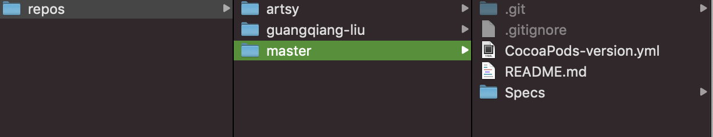
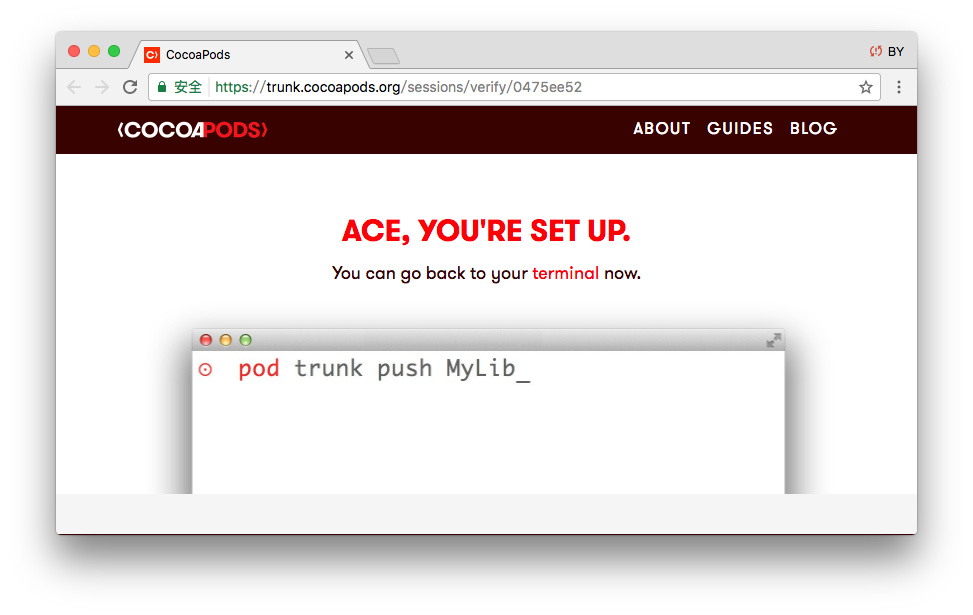
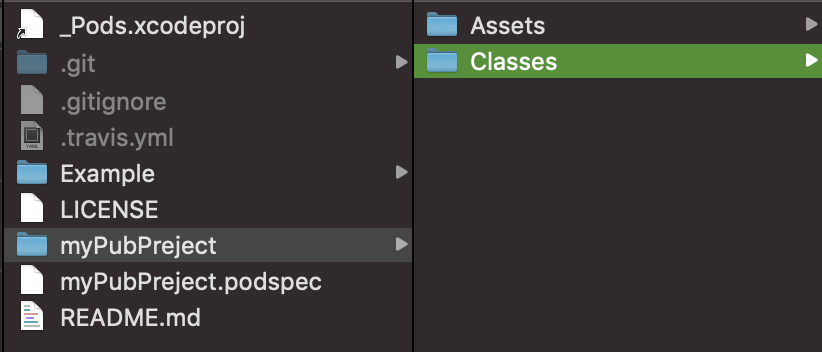
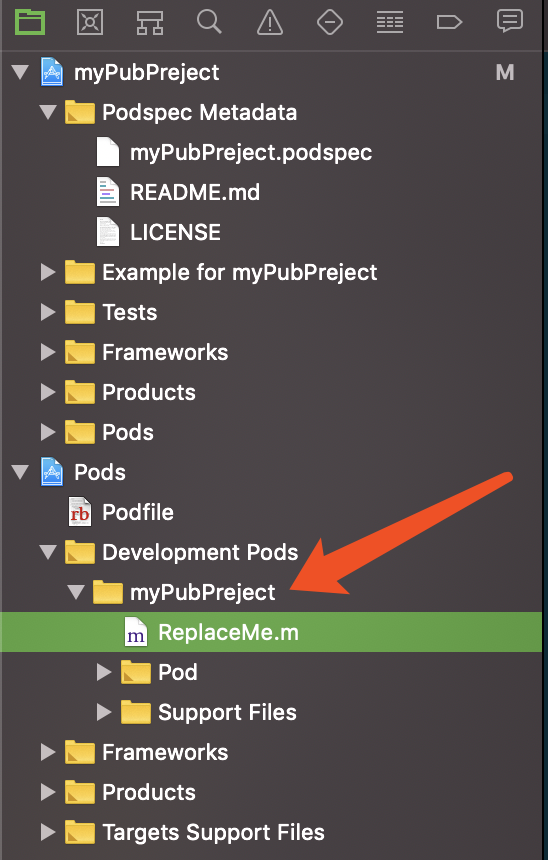

# pod创建公有库

### CocoaPod本地文件夹有什么？
从finder文进入： `~/.cocoapods/repos/`


从repos中可以看到：
* github远程公有仓库。https://github.com/CocoaPods/Specs.git
* artsy公有仓库
* guangqiang-liu公有库

cocoapod公有仓库其实就是我们写好了代码，通过pod 命令注册到master公有库。

## 如何创建自己的公有库？

### 注册 CocoaPods 账号

```
pod trunk register GitHub_email 'user_name' --verbose
```
终端注册email和用户名，如果通过注册，会出现以下提示：
> [!] Please verify the session by clicking the link in the verification email that has been sent to you_email@163.com

进入邮箱激活账户。


查看注册是否成功：

```
pod trunk me
```
得到如下结果：

```
  - Name:     HeathWang
  - Email:    yishu.jay@gmail.com
  - Since:    June 21st, 2017 04:22
  - Pods:
    - HWCategoryList
  - Sessions:
    - June 21st, 2017 04:22 - October 27th, 2017 04:23. IP: 220.248.17.218
    - October 24th, 20:15   -    April 2nd, 2019 23:43. IP: 113.212.225.104
```

### 创建pod 项目
终端输入：

```
pod lib create myPubPreject
```
输入：

```pod
➜  My code pod lib create myPubPreject
Cloning `https://github.com/CocoaPods/pod-template.git` into `myPubPreject`.
Configuring myPubPreject template.

------------------------------

To get you started we need to ask a few questions, this should only take a minute.

2018-11-26 13:50:14.992 defaults[2725:82445]
The domain/default pair of (org.cocoapods.pod-template, HasRunbefore) does not exist
If this is your first time we recommend running through with the guide:
 - https://guides.cocoapods.org/making/using-pod-lib-create.html
 ( hold cmd and click links to open in a browser. )

 Press return to continue.


What platform do you want to use?? [ iOS / macOS ]
 > iOS

What language do you want to use?? [ Swift / ObjC ]
 > ObjC

Would you like to include a demo application with your library? [ Yes / No ]
 > YES

Which testing frameworks will you use? [ Specta / Kiwi / None ]
 > None

Would you like to do view based testing? [ Yes / No ]
 > No

What is your class prefix?
 > HW

Running pod install on your new library.
```

目录结构如下：


核心代码，也就是发布的库代码放到Classes文件夹中，Example文件夹中可以编写示例。
对应的xcode项目中，源文件应该放到：


最主要的是`myPubPreject.podspec`，这里我们需要修改配置，包括库的名字，描述，依赖的第三方库等。


```
#
# Be sure to run `pod lib lint myPubPreject.podspec' to ensure this is a
# valid spec before submitting.
#
# Any lines starting with a # are optional, but their use is encouraged
# To learn more about a Podspec see https://guides.cocoapods.org/syntax/podspec.html
#

Pod::Spec.new do |s|
  s.name             = 'myPubPreject'
  s.version          = '0.1.0'
  s.summary          = 'A short description of myPubPreject.'

# This description is used to generate tags and improve search results.
#   * Think: What does it do? Why did you write it? What is the focus?
#   * Try to keep it short, snappy and to the point.
#   * Write the description between the DESC delimiters below.
#   * Finally, don't worry about the indent, CocoaPods strips it!

  s.description      = <<-DESC
TODO: Add long description of the pod here.
                       DESC

  s.homepage         = 'https://github.com/HeathWang/myPubPreject'
  # s.screenshots     = 'www.example.com/screenshots_1', 'www.example.com/screenshots_2'
  s.license          = { :type => 'MIT', :file => 'LICENSE' }
  s.author           = { 'HeathWang' => 'wangcongling@niwodai.net' }
  s.source           = { :git => 'https://github.com/HeathWang/myPubPreject.git', :tag => s.version.to_s }
  # s.social_media_url = 'https://twitter.com/<TWITTER_USERNAME>'

  s.ios.deployment_target = '8.0'

  s.source_files = 'myPubPreject/Classes/**/*'
  
  # s.resource_bundles = {
  #   'myPubPreject' => ['myPubPreject/Assets/*.png']
  # }

  # s.public_header_files = 'Pod/Classes/**/*.h'
  # s.frameworks = 'UIKit', 'MapKit'
  # s.dependency 'AFNetworking', '~> 2.3'
end

```

### 提交远程仓库，打tag
开发完成，测试通过后，我们需要通过打tag的方式来确定pod库的版本。

```
创建标签
$ git tag -a 1.0.0 -m '标签说明' 
推送到远程
$ git push origin --tags
```
这里我们发布了一个1.0.0的版本，那么podspec中对应1.0.0

### 发布库
验证.podSpec是否正确

```
pod lib lint
```
根据提示修改只到出现：

```
myPubPreject passed validation.	
```

发布到远程pod：

```
pod trunk push myPubPreject.podspec
```
这一步的操作其实包含：
1. 更新本地 pods 库 ~/.cocoaPods.repo/master
2. 验证.podspec格式是否正确
3. 将 .podspec 文件转成 JSON 格式
4. 对 master 仓库 进行合并、提交.master仓库地址

### 更新维护
库发布后，oops，发现bug了，我们修复了bug，then：

1. 打tag 1.0.1，push到远程github。
2. 更新podspec到1.0.1
3. `pod trunk push myPubPreject.podspec` 推送到pods仓库。


# pod创建私有库

公有库和私有库唯一的不同是私有库需要有管理**私有库的spec**，另外需要git仓库来存放我们创建的私有库和相关的spec，比如公司自己搭建的git，码云等等。


## 私有的 Spec 索引库
[CocoaPods 私有仓库的创建（超详细）](https://www.jianshu.com/p/0c640821b36f)
这里讲的够详细了。

