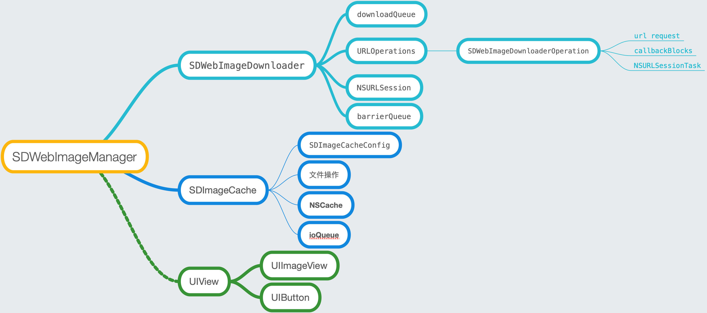
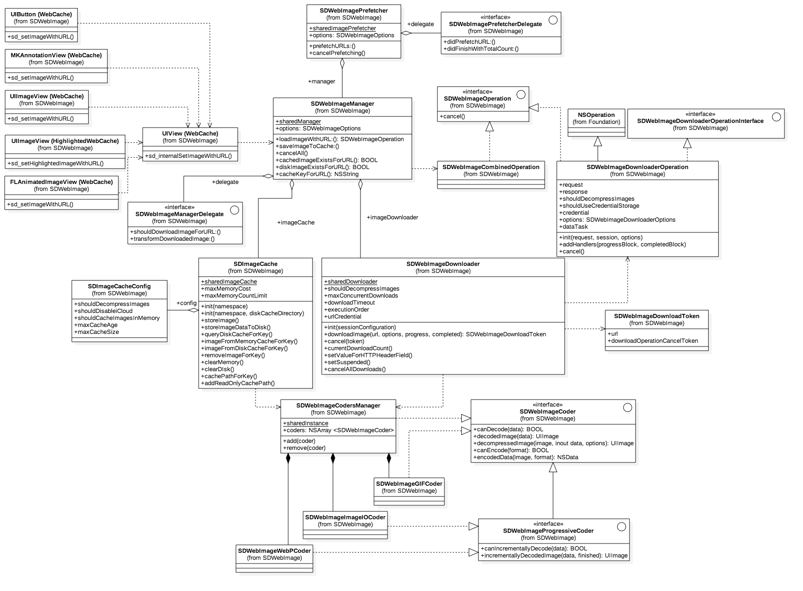

# SDWebImage 源码阅读

## SDImageCache

`
SDImageCache maintains a memory cache and an optional disk cache. Disk cache write operations are performed asynchronous so it doesn’t add unnecessary latency to the UI.
`

SDImageCache作为SDWebImage当中的缓存类，提供了磁盘缓存以及内存缓存。
SDImageCache一般直接用作单例来使用，初始化时几个重要属性：**memCache**用作内存缓存，**ioQueue**是用作写入磁盘的队列，另外需要根据namespace来生成**diskCachePath**。初始化NSFileManager用于操作文件读写处理，添加Observer用于监听app内存警告、app关闭，app进入后台的notification。

####核心方法
SDImageCache核心的方法有针对图片的**存储**和**读取**。
###### 存储

```Objective-C
- (void)storeImage:(nullable UIImage *)image
         imageData:(nullable NSData *)imageData
            forKey:(nullable NSString *)key
            toDisk:(BOOL)toDisk
        completion:(nullable SDWebImageNoParamsBlock)completionBlock {
    if (!image || !key) {
        if (completionBlock) {
            completionBlock();
        }
        return;
    }
    // if memory cache is enabled
    if (self.config.shouldCacheImagesInMemory) {
        NSUInteger cost = SDCacheCostForImage(image);
        [self.memCache setObject:image forKey:key cost:cost];
    }
    
    if (toDisk) {
        dispatch_async(self.ioQueue, ^{
            @autoreleasepool {
                NSData *data = imageData;
                if (!data && image) {
                    // If we do not have any data to detect image format, check whether it contains alpha channel to use PNG or JPEG format
                    /*...*/
                [self storeImageDataToDisk:data forKey:key];
            }
            
            if (completionBlock) {
                dispatch_async(dispatch_get_main_queue(), ^{
                    completionBlock();
                });
            }
        });
    } else {
        if (completionBlock) {
            completionBlock();
        }
    }
}
```
图片存储最终都调用到这个方法：
    1. 首先根据单例中的缓存配置看是否应该将图片缓存在内存。
    2. 判断是否存入磁盘，是的话在串行的ioQueue中执行存入磁盘操作。
    3. 如果没有将图片转为data，会根据是否是包含`alpha channel`来辨别是PNG OR JPEG。然后调用SDWebImageCodersManager来encode image to NSData。之后写入磁盘。
    4. 在主线程执行完成的completionBlock。


对于写入数据没有什么好说的，每次都会判断写入的folder是否存在，no，创建folder，然后写入
    
-------
###### 查询Query
图片查询读取没有什么复杂的逻辑，涉及到从磁盘和内存读取图片。
其中需要注意的是，在从磁盘读取图片的时候，先根据文件url读取一遍，如果没有获取到，再去掉文件类型后缀查询一遍。

```Objective-C
- (void)diskImageExistsWithKey:(nullable NSString *)key completion:(nullable SDWebImageCheckCacheCompletionBlock)completionBlock {
    dispatch_async(_ioQueue, ^{
        BOOL exists = [_fileManager fileExistsAtPath:[self defaultCachePathForKey:key]];

        // fallback because of https://github.com/rs/SDWebImage/pull/976 that added the extension to the disk file name
        // checking the key with and without the extension
        if (!exists) {
            exists = [_fileManager fileExistsAtPath:[self defaultCachePathForKey:key].stringByDeletingPathExtension];
        }

        if (completionBlock) {
            dispatch_async(dispatch_get_main_queue(), ^{
                completionBlock(exists);
            });
        }
    });
}
```

-------
###### 删除图片数据
删除磁盘数据时会同时清理内存里的图片数据（如果存在的话）。

###### 缓存清理
* 内存和磁盘缓存的单独清理没有什么亮点可说，需要注意的时磁盘的读写操作均在ioQueue的串行队列中完成。
* 比较复杂的是`- (void)deleteOldFiles`方法，该方法会最终调用`- (void)deleteOldFilesWithCompletionBlock:(nullable SDWebImageNoParamsBlock)completionBlock`方法：

    1.首先遍历磁盘缓存文件夹下所有的缓存文件，获取文件的**修改时间**，**文件大小**。         
    2.根据配置的最大缓存时间（默认一周）取得文件失效时间_expirationDate_。
    3.遍历文件属性数组，如果文件的修改时间小于设置的失效时间，加入删除数组，大于的话，就把数据加入到缓存的字典里，并且累加未删除图片的总大小。
    4.执行删除操作，之后判断maxCacheSize是否小于当前未删除图片的总大小，如果是，继续执行删除操作，需要删除maxCacheSize/2的容量文件。
    5.对未删除的缓存文件修改时间进行排序，时间旧的在最前，执行遍历删除操作直到缓存文件总大小小于配置的maxCacheSize/2。

##SDWebImageDownloader
SDWebImageDownloader作为SDWebImageManager核心类初始化时必传入的一个参数之一，主要用于管理下载图片。
`
Asynchronous downloader dedicated and optimized for image loading.
`
####初始化
SDWebImageDownloader几个重要的属性：

```Objective-C
@property (strong, nonatomic, nonnull) NSOperationQueue *downloadQueue;
@property (weak, nonatomic, nullable) NSOperation *lastAddedOperation;
@property (assign, nonatomic, nullable) Class operationClass;
@property (strong, nonatomic, nonnull) NSMutableDictionary<NSURL *, SDWebImageDownloaderOperation *> *URLOperations;
@property (strong, nonatomic, nullable) SDHTTPHeadersMutableDictionary *HTTPHeaders;
// This queue is used to serialize the handling of the network responses of all the download operation in a single queue
@property (strong, nonatomic, nullable) dispatch_queue_t barrierQueue;

// The session in which data tasks will run
@property (strong, nonatomic) NSURLSession *session;
```
* 用于下载的NSOperationQueue，根据下载图片策略（FIFO -先进先出/LIFO -后进先出）来设置队列依赖。

```Objective-C
if (sself.executionOrder == SDWebImageDownloaderLIFOExecutionOrder) {
            // Emulate LIFO execution order by systematically adding new operations as last operation's dependency
            [sself.lastAddedOperation addDependency:operation];
            sself.lastAddedOperation = operation;
        }
```
* 最大并行数默认为6，默认下载超时15s。
* 栅栏队列用于处理字典**URLOperations**添加删除操作。

####核心方法流程

```
- (nullable SDWebImageDownloadToken *)downloadImageWithURL:(nullable NSURL *)url
                                                   options:(SDWebImageDownloaderOptions)options
                                                  progress:(nullable SDWebImageDownloaderProgressBlock)progressBlock
                                                 completed:(nullable SDWebImageDownloaderCompletedBlock)completedBlock
```
以上方法用于根据传入的url下载图片，该方法返回一个SDWebImageDownloadToken用于cancel下载任务。
这个方法直接调用了另外一个方法：

```
- (nullable SDWebImageDownloadToken *)addProgressCallback:(SDWebImageDownloaderProgressBlock)progressBlock
                                           completedBlock:(SDWebImageDownloaderCompletedBlock)completedBlock
                                                   forURL:(nullable NSURL *)url
                                           createCallback:(SDWebImageDownloaderOperation *(^)(void))createCallback
```
addProgress...方法首先根据url去查找SDWebImageDownloaderOperation，如果没有，则调用createCallback block去生成downloadOperation，之后实现operation 完成操作的回调block，然后根据operation生成token。

```Objective-C
dispatch_barrier_sync(self.barrierQueue, ^{
        SDWebImageDownloaderOperation *operation = self.URLOperations[url];
        if (!operation) {
            operation = createCallback();
            self.URLOperations[url] = operation;

            __weak SDWebImageDownloaderOperation *woperation = operation;
            operation.completionBlock = ^{
            // 移除operation
				/* */
				});
            };
        }
        id downloadOperationCancelToken = [operation addHandlersForProgress:progressBlock completed:completedBlock];

        token = [SDWebImageDownloadToken new];
        token.url = url;
        token.downloadOperationCancelToken = downloadOperationCancelToken;
    });
    // return token.
```
生成operation的block比较长，简单来说，配置NSMutableURLRequest，初始化SDWebImageDownloaderOperation，设置operation优先级，设置下载策略（FIFO/LIFO）。

```Objective-C
 // In order to prevent from potential duplicate caching (NSURLCache + SDImageCache) we disable the cache for image requests if told otherwise
        NSURLRequestCachePolicy cachePolicy = options & SDWebImageDownloaderUseNSURLCache ? NSURLRequestUseProtocolCachePolicy : NSURLRequestReloadIgnoringLocalCacheData;
        NSMutableURLRequest *request = [[NSMutableURLRequest alloc] initWithURL:url
                                                                    cachePolicy:cachePolicy
                                                                timeoutInterval:timeoutInterval];
        
        // 配置request参数...
        SDWebImageDownloaderOperation *operation = [[sself.operationClass alloc] initWithRequest:request inSession:sself.session options:options];
        operation.shouldDecompressImages = sself.shouldDecompressImages;
        
        // 配置operation
        
        if (options & SDWebImageDownloaderHighPriority) {
            operation.queuePriority = NSOperationQueuePriorityHigh;
        } else if (options & SDWebImageDownloaderLowPriority) {
            operation.queuePriority = NSOperationQueuePriorityLow;
        }

        [sself.downloadQueue addOperation:operation];
        if (sself.executionOrder == SDWebImageDownloaderLIFOExecutionOrder) {
            // Emulate LIFO execution order by systematically adding new operations as last operation's dependency
            [sself.lastAddedOperation addDependency:operation];
            sself.lastAddedOperation = operation;
        }

        return operation;
```

-------
SDWebImageDownloader实现了NSURLSessionTaskDelegate，NSURLSessionDataDelegate，但是其实它只做了分发。在delegate实现中，根据dataTask获取到operation，然后传递给operation来处理。

##SDWebImageDownloaderOperation
该operation适配了SDWebImageDownloaderOperation protocol，这样的话其他开发可以根据protocol来自定义operation。
`Describes a downloader operation. If one wants to use a custom downloader op, it needs to inherit from `NSOperation` and conform to this protocol`


```Objective-C
@interface SDWebImageDownloaderOperation : NSOperation <SDWebImageDownloaderOperationInterface, SDWebImageOperation, NSURLSessionTaskDelegate, NSURLSessionDataDelegate>
```
其中SDWebImageOperation中只有一个`- (void)cancel`方法。
初始化时传入了request和NSURLSession。可以看到在头文件中暴露了只读属性的dataTask。
####核心方法
当operation加入queue，start方法会被调用，请求开始：

```Objective-C
- (void)start {
    @synchronized (self) {
        if (self.isCancelled) {
            self.finished = YES;
            [self reset];
            return;
        }

        // 判断是否可以后台下载
        /*
        ...
        */

        if (self.options & SDWebImageDownloaderIgnoreCachedResponse) {
            // Grab the cached data for later check
            NSCachedURLResponse *cachedResponse = [[NSURLCache sharedURLCache] cachedResponseForRequest:self.request];
            if (cachedResponse) {
                self.cachedData = cachedResponse.data;
            }
        }
        
        // 如果unownedSession不存在，创建urlSession，赋值给ownedSession
        NSURLSession *session = self.unownedSession;
        /*
        ...
         */
        
        self.dataTask = [session dataTaskWithRequest:self.request];
        self.executing = YES;
    }
    
    [self.dataTask resume];

    if (self.dataTask) {
    	// 执行block
        for (SDWebImageDownloaderProgressBlock progressBlock in [self callbacksForKey:kProgressCallbackKey]) {
            progressBlock(0, NSURLResponseUnknownLength, self.request.URL);
        }
        __weak typeof(self) weakSelf = self;
        // 发送通知
        dispatch_async(dispatch_get_main_queue(), ^{
            [[NSNotificationCenter defaultCenter] postNotificationName:SDWebImageDownloadStartNotification object:weakSelf];
        });
    } else {
        [self callCompletionBlocksWithError:[NSError errorWithDomain:NSURLErrorDomain code:0 userInfo:@{NSLocalizedDescriptionKey : @"Connection can't be initialized"}]];
    }

}
```
####多个回调处理
这个类暴露在外部的一个方法：

```Objective-C
- (nullable id)addHandlersForProgress:(nullable SDWebImageDownloaderProgressBlock)progressBlock
                            completed:(nullable SDWebImageDownloaderCompletedBlock)completedBlock {
    SDCallbacksDictionary *callbacks = [NSMutableDictionary new];
    if (progressBlock) callbacks[kProgressCallbackKey] = [progressBlock copy];
    if (completedBlock) callbacks[kCompletedCallbackKey] = [completedBlock copy];
    dispatch_barrier_async(self.barrierQueue, ^{
        [self.callbackBlocks addObject:callbacks];
    });
    return callbacks;
}
```
SDCallbacksDictionary定义如下`typedef NSMutableDictionary<NSString *, id> SDCallbacksDictionary;`
value是回调block，callbackBlocks是SDCallbacksDictionary类型的数组。这样其实就可以添加多个block，如果有多个对象需要接受回调，通过该方法add回调。
通过key获取所有的回调block：

```Objective-C
- (nullable NSArray<id> *)callbacksForKey:(NSString *)key {
    __block NSMutableArray<id> *callbacks = nil;
    dispatch_sync(self.barrierQueue, ^{
        // We need to remove [NSNull null] because there might not always be a progress block for each callback
        callbacks = [[self.callbackBlocks valueForKey:key] mutableCopy];
        [callbacks removeObjectIdenticalTo:[NSNull null]];
    });
    return [callbacks copy];    // strip mutability here
}
```

其他关于NSURLSessionDataDelegate和NSURLSessionTaskDelegate的相关处理不是太复杂，pass。

##SDWebImageManager
SDWebImageManager可以说是该框架最核心的类，以上介绍了几个关键类都是为SDWebImageManager服务的。
`
The SDWebImageManager is the class behind the UIImageView+WebCache category and likes. It ties the asynchronous downloader (SDWebImageDownloader) with the image cache store (SDImageCache). You can use this class directly to benefit from web image downloading with caching in another context than a UIView.
`
#### 初始化
SDWebImageManager在初始化时会出示SDImageCache和SDWebImageDownloader 2个重要的类用于缓存和下载使用。同时还有初始化一个NSMutableSet用于标记下载失败的url。
`By default, when a URL fail to be downloaded, the URL is blacklisted so the library won't keep trying. This flag disable this blacklisting.`
默认情况下，下载失败将会加入failedURLs中，不会重试。
初始化数组runningOperations用于保存正在run的operations。

####核心load image方法

```Objective-C
- (id <SDWebImageOperation>)loadImageWithURL:(nullable NSURL *)url
                                     options:(SDWebImageOptions)options
                                    progress:(nullable SDWebImageDownloaderProgressBlock)progressBlock
                                   completed:(nullable SDInternalCompletionBlock)completedBlock;
```
该方法很长，比较复杂，流程如下：
1. 首先如果传入的url为String，转为NSURL。
2. 创建SDWebImageCombinedOperation，加持__Block, __weak.
3. 检查failedURLs时候包含该url，如果url为空，或者failedURLs包含该url，并且SDWebImageOptions不包含SDWebImageRetryFailed，直接执行callCompletionBlockForOperation 方法，传入NSError。
4. operation加入runningOperations，生成cacheKey。
5. 从缓存根据cacheKey查找图片，并返回一个cacheOperation，回调block中返回图片，data，缓存类型（内存/disk）。
6. 这里有一个比较绕的if判断，符合该逻辑进入if代码：
`1.如果缓存图片不存在或者options为SDWebImageRefreshCached（刷新缓存）。
2.SDWebImageManagerDelegate没有实现imageManager:shouldDownloadImageForURL:方法 OR 实现了该方法并返回YES（也就是下载图片）
`
7.如果单纯图片存在，执行回调block：SDInternalCompletionBlock。
8.最后的else基本什么没返回，没error，没data，没image，缓存none。这是因为用户在delegate中禁止下载该图片！

#####分析上一步if中代码
如果缓存图片存在，并且SDWebImageRefreshCached，先call完成的block。

```Objective-C
if (cachedImage && options & SDWebImageRefreshCached) {
                // If image was found in the cache but SDWebImageRefreshCached is provided, notify about the cached image
                // AND try to re-download it in order to let a chance to NSURLCache to refresh it from server.
                [self callCompletionBlockForOperation:weakOperation completion:completedBlock image:cachedImage data:cachedData error:nil cacheType:cacheType finished:YES url:url];
            }
```
根据SDWebImageOptions参数，计算SDWebImageDownloaderOptions参数。然后用imageDownloader下载图片并返回SDWebImageDownloadToken，该token用于取消下载。
下载完成的block中：

* 如果下载有错误，执行**callCompletionBlockForOperation**；根据错误code，判断是否加入failedURLs。
* 没有错误，会根据options来处理相关逻辑。比如是否存入磁盘，最终调用callCompletionBlockForOperation完成操作。

##### 取消下载操作
因为每次加载图片时会生成SDWebImageCombinedOperation，当执行cancel操作时，如果存在cacheOperation，执行cacheOperation的cancel操作，如果cancelBlock存在，执行cancelBlock操作。
前者针对cache的操作，后者针对downloader操作。

##UIImageView加载网络图片流程
最终会调用到UIImageView中的方法：

```Objective-C
- (void)sd_setImageWithURL:(nullable NSURL *)url
          placeholderImage:(nullable UIImage *)placeholder
                   options:(SDWebImageOptions)options
                  progress:(nullable SDWebImageDownloaderProgressBlock)progressBlock
                 completed:(nullable SDExternalCompletionBlock)completedBlock
```
而改方法会调用UIView category方法中的：

```Objective-C
- (void)sd_internalSetImageWithURL:(nullable NSURL *)url
                  placeholderImage:(nullable UIImage *)placeholder
                           options:(SDWebImageOptions)options
                      operationKey:(nullable NSString *)operationKey
                     setImageBlock:(nullable SDSetImageBlock)setImageBlock
                          progress:(nullable SDWebImageDownloaderProgressBlock)progressBlock
                         completed:(nullable SDExternalCompletionBlock)completedBlock
                           context:(nullable NSDictionary *)context
```
参数**operationKey**一般为默认（该类class名称），context一般为nil。
首先取消掉上次加载图片操作。
url不为空，先判断是否显示加载图片indicator，是的话，在view上加载菊花。
获取SDWebImageManager，然后loadImageWithURL，并返回SDWebImageCombinedOperation，并把该operation通过runtime添加属性存储起来。这样做的目的是，要执行cancel操作时，再根据key取出operation执行cancel。

##### SDWebImageManager加载图片完成block
* 移除加载图片菊花，如果存在。
* 针对下载到图片，但是option=SDWebImageAvoidAutoSetImage OR 没有下载到图片并option=SDWebImageDelayPlaceholder，主线程call completedBlock，并return。
* 拿到图片，主线程更新图片，然后call completedBlock。
* 更新图片，如果不存在setImageBlock，则会根据class判断是UIImageView or UIButton。


```Objective-C
- (void)sd_setImage:(UIImage *)image imageData:(NSData *)imageData basedOnClassOrViaCustomSetImageBlock:(SDSetImageBlock)setImageBlock {
    // 比如UIButton会有多个状态，这个时候根据该block来更新UI。
    if (setImageBlock) {
        setImageBlock(image, imageData);
        return;
    }
    /*
    根据class判断是UIImageView or UIButton，设置图片
    */
    ......
}
```

## UIButton设置背景图片

```Objective-C
- (void)sd_setBackgroundImageWithURL:(nullable NSURL *)url
                            forState:(UIControlState)state
                    placeholderImage:(nullable UIImage *)placeholder
                             options:(SDWebImageOptions)options
                           completed:(nullable SDExternalCompletionBlock)completedBlock
```
和UIImageView不同的是button有state，所以最终执行到UIView的方法时，提供了operationKey：`[NSString stringWithFormat:@"UIButtonBackgroundImageOperation%@", @(state)]`。
并且setImageBlock中根据state设置背景图。

##总结
SDWebImage 中为 UIView 提供了一个分类叫做 WebCache, 这个分类中有一个最常用的接口, `sd_setImageWithURL:placeholderImage:`, 这个分类同时提供了很多类似的方法, 这些方法最终会调用一个同时具有 `option` `progressBlock` `completionBlock` 的方法, 而在这个类最终被调用的方法首先会检查是否传入了 `placeholderImage` 以及对应的参数, 并设置 `placeholderImage`.
    
然后会获取 `SDWebImageManager` 中的单例调用一个 `downloadImageWithURL:...` 的方法来获取图片, 而这个 manager 获取图片的过程有大体上分为两部分, 它首先会在 `SDWebImageCache` 中寻找图片是否有对应的缓存, 它会以 url 作为数据的索引先在内存中寻找是否有对应的缓存, 如果缓存未命中就会在磁盘中利用 MD5 处理过的 key 来继续查询对应的数据, 如果找到了, 就会把磁盘中的缓存备份到内存中.
    
然而, 假设我们在内存和磁盘缓存中都没有命中, 那么 manager 就会调用它持有的一个 `SDWebImageDownloader` 对象的方法 `downloadImageWithURL:...` 来下载图片, 这个方法会在执行的过程中调用另一个方法 `addProgressCallback:andCompletedBlock:forURL:createCallback:` 来存储下载过程中和下载完成的回调, 当回调块是第一次添加的时候, 方法会实例化一个 `NSMutableURLRequest` 和 `SDWebImageDownloaderOperation`, 并将后者加入 downloader 持有的下载队列开始图片的异步下载.
    
而在图片下载完成之后, 就会在主线程设置 `image` 属性, 完成整个图像的异步下载和配置.

##总结

`SDWebImage` 的图片加载过程其实很符合我们的直觉: 

* 查看缓存
	* 缓存命中
    	* 返回图片
        * 更新 `UIImageView`
   * 缓存未命中
    	* 异步下载图片
        * 加入缓存
        * 更新 `UIImageView`

##简单导图





