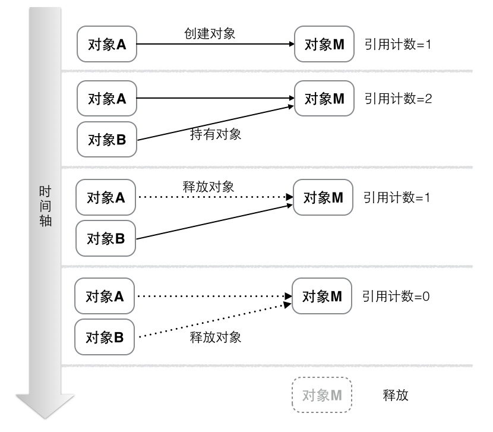

# iOS内存管理
个人认为唐巧的博客已经对内存管理讲解的比较详细了：
[理解 iOS 的内存管理](https://blog.devtang.com/2016/07/30/ios-memory-management/)

## 引用计数
iOS中对于对象的内存管理，主要是通过引用计数（Reference Count）。
一个对象被创建时，引用计数为1。当有一个新的实例持有该对象时，引用计数+1。当一个实例对象不再持有该对象，引用计数-1.如果对象引用计数为0，系统会将该对象销毁，回收内存。

> 通过 retainCount 的机制来决定对象是否需要释放。 每次 runloop 的时候，都会检查对象的 retainCount，如果retainCount 为 0，说明该对象没有地方需要继续使用了，可以释放掉了。

系统是不会立即销毁回收引用计数为0的对象。



用一种很形象的说法来描述：该对象我们可以看成一只狗，A持有该对象，就像A用一条绳子拴住了这条狗，B持有该对象，B用一条绳子拴住了这条狗。当A，B都把绳子砍断，不在持有这条狗，狗会跑掉，free！

## ARC
在最初期MRC，手动管理引用计数时，开发者要频繁的retain，release对象，出错率极高。
因此Apple在2011年推出了ARC。**ARC 背后的原理是依赖编译器的静态分析能力，通过在编译时找出合理的插入引用计数管理代码，从而彻底解放程序员。**

确切的来说，ARC分编译器和运行期2部分功能帮助开发者管理内存：
* 在编译期，ARC用的是更底层的C接口实现的retain/release/autorelease。


## 循环引用
循环引用一般是由对象之间互相**强**引用持有对方而产生的。
一般来说，比如一个ViewController持有一个view，view又strong持有了该ViewController。
又或者一个对象中有一个strong的属性A，A在对象中调用了一个包含block回调的方法，block中有相关该对象self出现，也造成的循环引用。

### 使用xcode检测循环引用
Xcode的Instruments-Leaks可以检测。


# iOS中的block
参照掘金文章：
[iOS底层原理总结 - 探寻block的本质（一）](https://juejin.im/post/5b0181e15188254270643e88)
[iOS底层原理总结 - 探寻block的本质（二）](https://juejin.im/post/5b0d026bf265da090e3decb7)

## block修改外部变量为什么要用__block ？

```Objective-C
int main(int argc, const char * argv[]) {
    @autoreleasepool {
        int age = 10;
        Block block = ^ {
            // age = 20; // 无法修改
            NSLog(@"%d",age);
        };
        block();
    }
    return 0;
}

```
默认情况下block不能修改外部的局部变量。通过之前对源码的分析可以知道。

age是在main函数内部声明的，说明**_age的内存存在于main函数的栈空间内部_**，但是block内部的代码在__main_block_func_0函数内部。__main_block_func_0函数内部无法访问age变量的内存空间，**两个函数的栈空间不一样**，__main_block_func_0内部拿到的age是block结构体内部的age，因此无法在__main_block_func_0函数内部去修改main函数内部的变量。

如何解决？
1. age使用static修饰。
前文提到过static修饰的age变量传递到block内部的是指针，在__main_block_func_0函数内部就可以拿到age变量的内存地址，因此就可以在block内部修改age的值。

2. __block修饰
__block用于解决block内部不能修改auto变量值的问题，
__block不能修饰静态变量（static） 和全局变量。

