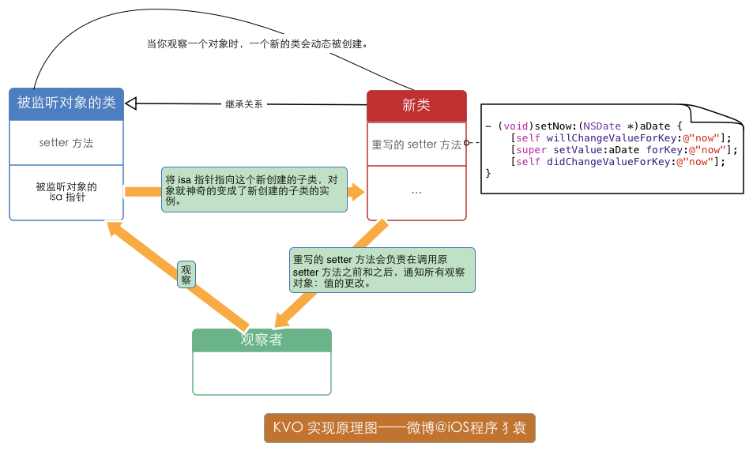
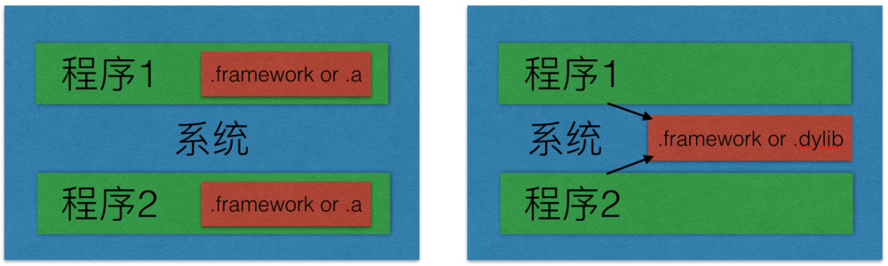

# iOS小知识
## iOS中方法初始化

```
- (instancetype)initWithUsername:(NSString *)username
                        comments:(NSArray<NSString *> *)comments NS_DESIGNATED_INITIALIZER;

- (instancetype)init NS_UNAVAILABLE;
+ (instancetype)new NS_UNAVAILABLE;
```
实际的开发过程中，可能我们有需求初始化对象，但是只能按照我们规定的方法去初始化对象。可以使用`NS_DESIGNATED_INITIALIZER`来描述初始化方法。
另外NSObject对象默认都会实现init方法，所以必要情况下可以禁用掉`init`和`new`方法。如果使用的是UIView对象，`- (instancetype)initWithFrame:(CGRect)frame;`可以禁用掉。使用关键字**`NS_UNAVAILABLE`**来描述禁用方法。

## iOS中load和initialize区别
####相同点
1. **load**和**initialize**会被自动调用，不能手动调用它们。
2. 子类实现了**load**和**initialize**的话，会隐式调用父类的**load**和**initialize**方法。
3. **load**和**initialize**方法内部使用了锁，因此它们是线程安全的。

####不同点
1. 子类中没有实现**load**方法的话，不会调用父类的**load**方法；而子类如果没有实现**initialize**方法的话，也会自动调用父类的**initialize**方法。
2. **load**方法是在类被加载的时候就会调用，**initialize**在第一次给某个类发送消息时调用（比如实例化一个对象），并且只会调用一次，是懒加载模式，如果这个类一直没有使用，就不回调用到**initialize**方法。
3. 子类、父类和分类中的 +load 方法的实现是被区别对待的。换句话说在 Objective-C runtime 自动调用 +load 方法时，分类中的 +load 方法并不会对主类中的 +load 方法造成覆盖。

####使用场景 
##### load
load一般是用来交换方法Method Swizzle，由于它是线程安全的，而且一定会调用且只会调用一次，通常在使用UrlRouter的时候注册类的时候也在load方法中注册
##### initialize
initialize方法主要用来对一些不方便在编译期初始化的对象进行赋值，或者说对一些静态常量进行初始化操作

##栅栏函数的使用dispatch_barrier_async和dispatch_barrier_sync

```Objective-C
void dispatch_barrier_async(dispatch_queue_t queue, dispatch_block_t block);
void dispatch_barrier_sync(dispatch_queue_t queue, dispatch_block_t block);
```
这2个队列函数必须使用在用户创建的并发队列里。
`The queue you specify should be a concurrent queue that you create yourself using the dispatch_queue_create function. If the queue you pass to this function is a serial queue or one of the global concurrent queues, this function behaves like the dispatch_sync function.`


```Objective-C
_barrierQueue = dispatch_queue_create("com.hackemist.SDWebImageDownloaderBarrierQueue", DISPATCH_QUEUE_CONCURRENT);
```
####相同点
* 等待该函数前面的任务先完成，再执行block中的任务。
* 等待block中的任务执行完毕，才会执行后面的任务。

####不同点
* dispatch_barrier_sync将自己的任务插入到队列的时候，需要等待自己的任务结束之后才会继续插入被写在它后面的任务，然后执行它们。
* dispatch_barrier_async将自己的任务插入到队列之后，不会等待自己的任务结束，它会继续把后面的任务插入到队列，然后等待自己的任务结束后才执行后面任务。

## NSDictionary和NSMaptable区别
###相同点
* 都是k-v 


###不同点
* NSMapTable对于NSDictionary来说，优点在于：可以指定key/value是需要strong，weak，甚至copy。如果为weak，当key或value被释放的时候，会自动从NSMapTable中移除这一项。
    * NSPointerFunctionsMachVirtualMemory
    * NSPointerFunctionsMallocMemory
    * NSPointerFunctionsOpaqueMemory
    * NSPointerFunctionsStrongMemory
    * NSPointerFunctionsWeakMemory
    * ~~NSPointerFunctionsZeroingWeakMemory~~
* NSMapTable是可变的，不像NSDictionary还有个对应的NSMutableDictionary可变类。
* NSDcitionary或者NSMutableDictionary中对于key和value的内存管理是，对key进行copy，对value进行强引用，只有满足NSCopying协议的对象才能成为key值。NSMaptable可以通过弱引用来持有keys和values，所以当key或者value被deallocated的时候，所存储的实体也会被移除。
* NSDcitionary  key应该是轻量级的，通常是字符串或数字。但这个是key-to-object映射，而不是object-to-object.而NSMapTabTable更适合于我们一般所说的映射标准，它既可以处理key-to-value又可以处理object-to-object。

## NSHashTable和NSSet区别
NSHashTable效仿了NSSet(NSMutableSet)，但提供了比NSSet更多的操作选项，尤其是在对弱引用关系的支持上，NSHashTable在对象/内存处理时更加的灵活。相较于NSSet，NSHashTable具有以下特性：
1. NSSet(NSMutableSet)持有其元素的强引用，同时这些元素是使用hash值及isEqual:方法来做hash检测及判断是否相等的。
2. NSHashTable是可变的，它没有不可变版本。
3. NSHashTable可以持有元素的弱引用，而且在对象被销毁后能正确地将其移除。而这一点在NSSet是做不到的。
4. 它可以包含任意指针，其成员没有限制为对象。我们可以配置一个NSHashTable实例来操作任意的指针，而不仅仅是对象。

> The hash table is modeled after NSSet with the following differences:

> It can hold weak references to its members.

> Its members may be copied on input or may use pointer identity for equality and hashing.

> It can contain arbitrary pointers (its members are not constrained to being objects).

## NSDictionary底层实现原理
### NSDictionary介绍
> NSDictionary（字典）是使用 hash表来实现key和value之间的映射和存储的， hash函数设计的好坏影响着数据的查找访问效率。数据在hash表中分布的越均匀，其访问效率越高。而在Objective-C中，通常都是利用NSString 来作为键值，其内部使用的hash函数也是通过使用 NSString对象作为键值来保证数据的各个节点在hash表中均匀分布。

### NSDictionary内部结构
NSDictionary使用NSMapTable实现，NSMapTable同样是一个key－value的容器。

```Objective-C
@interface NSMapTable : NSObject {
   NSMapTableKeyCallBacks   *keyCallBacks;
   NSMapTableValueCallBacks *valueCallBacks;
   NSUInteger             count;
   NSUInteger             nBuckets;
   struct _NSMapNode  **buckets;
}
```
可以看出来NSMapTable是一个哈希＋链表的数据结构，因此在NSMapTable中插入或者删除一对对象时， 寻找的时间是O（1）＋O（m），m最坏时可能为n。
* O（1）：为对key进行hash得到bucket的位置。
* O（m）：遍历该bucket后面冲突的value，通过链表连接起来。

因此NSDictionary中的Key-Value遍历时是无序的，至如按照什么样的顺序，跟hash函数相关。NSMapTable使用NSObject的哈希函数。

```Objective-C
- (NSUInteger)hash {
   return (NSUInteger)self>>4;
}
```

### NSDictionary使用
NSMutableDictionary中最常用的一个方法原型：

```Objective-C
- (void)setObject:(id)anObject forKey:(id <NSCopying>)aKey;  
```
从这个方法中可以知道，要作为Key值，必须遵循NSCopying协议。也就是说在NSDictionary内部，会对aKey对象Copy一份新的。而anObject 对象在其内部是作为强引用（retain或strong)。所以在MRC下，向该方法发送消息之后，我们会向anObject发送release消息进行释放。
既然知道了作为key值，必须遵循NSCopying协议，说明除了NSString对象之外，我们还可以使用其他类型对象来作为NSDictionary的 key值。不过这还不够，作为key值，该类型还必须继承于NSObject并且要重载一下两个方法：

```Objective-C
- (NSUInteger)hash;  
- (BOOL)isEqual:(id)object;  
```
其中，hash 方法是用来计算该对象的 hash 值，最终的 hash 值决定了该对象在 hash 表中存储的位置。所以同样，如果想重写该方法，我们尽量设计一个能让数据分布均匀的 hash 函数。
所以如果对象key的hash值相同，那在hash表里面的对应的value值是相同的(value值被更新了)
isEqual方法是为了通过hash值来找到对象在hash表中的位置。

### setValue和setObject的区别

```Objective-C
- (void)setObject:(ObjectType)anObject forKey:(KeyType <NSCopying>)aKey;
- (void)setValue:(nullable ObjectType)value forKey:(NSString *)key;
```
setObject: ForKey:是NSMutableDictionary特有的；setValue: ForKey:是KVC的主要方法。
> (1) setValue: ForKey:的value是可以为nil的（但是当value为nil的时候，会自动调用removeObject：forKey方法）；
setObject: ForKey:的value则不可以为nil。
(2) setValue: ForKey:的key必须是不为nil的字符串类型；
setObject: ForKey:的key可以是不为nil的所有继承NSCopying的类型。

## 浅拷贝和深拷贝的区别
* 浅拷贝
    * 所谓的浅拷贝就是拷贝指向对象的指针,意思就是说:拷贝出来的目标对象的指针和源对象的指针指向的内存空间是同一块空间.
    * 浅拷贝只是一种简单的拷贝,让几个对象公用一个内存,然而当内存销毁的时候,指向这个内存空间的所有指针需要重新定义,不然会造成野指针错误。
* 深拷贝
    * 所谓的深拷贝指拷贝对象的具体内容,其内容地址是自助分配的,拷贝结束之后,内存中的值是完全相同的,但是内存地址是不一样的,两个对象之间相互不影响,也互不干涉。
* 我们来总结一下两者之间的原理 : 如果现在有一个A对象,拷贝之后得到一份新的对象A_Copy,如果时浅拷贝,那么A对象和A_Copy对象指向的就是同一个内存的资源,它拷贝的只是一个指针而已,对象的内容并没有拷贝.也就是说对象的资源还是只有一份.如果这个时候我们对A_copy对象进行修改操作,那么A对象的内容同样会被修改.然而如果是深拷贝,拷贝的不仅仅是指针,还有内容,拷贝的对象B_Copy会自助分配内存,两个对象的指针指向的是不同的内存空间,因为A对象和B_Copy对象的内存地址是不一样的,所以,如果我们对B_Copy进行修改操作的话是不会影响到A对象,它们之间是互不干涉的


* 浅拷贝就想是您和您的影子之间的关系 : 你挂了, 你的影子也跟着挂了
* 深拷贝就像是您的克隆人, 你挂啦, 可你的克隆人还活着

再简单些说：**浅复制就是指针拷贝；深复制就是内容拷贝。**

### 集合的浅复制 (shallow copy)
集合的浅复制有非常多种方法。当你进行浅复制时，会向原始的集合发送retain消息，引用计数加1，同时指针被拷贝到新的集合。

现在让我们看一些浅复制的例子：

```Objective-C
NSArray *shallowCopyArray = [someArray copyWithZone:nil];
NSSet *shallowCopySet = [NSSet mutableCopyWithZone:nil];
NSDictionary *shallowCopyDict = [[NSDictionary alloc] initWithDictionary:someDictionary copyItems:NO];
```
### 集合的深复制 (deep copy)
集合的深复制有两种方法。可以用 initWithArray:copyItems: 将第二个参数设置为YES即可深复制，如：

```Objective-C
NSDictionary shallowCopyDict = [[NSDictionary alloc] initWithDictionary:someDictionary copyItems:YES];
```
如果你用这种方法深复制，集合里的每个对象都会收到 copyWithZone: 消息。如果集合里的对象遵循 NSCopying 协议，那么对象就会被深复制到新的集合。**如果对象没有遵循 NSCopying 协议，而尝试用这种方法进行深复制，会在运行时出错。**copyWithZone: 这种拷贝方式只能够提供一层内存拷贝(one-level-deep copy)，而非真正的深复制。

第二个方法是将集合进行归档(archive)，然后解档(unarchive)，前提是对象必须实现NSCopying协议，如：

```Objective-C
NSArray *trueDeepCopyArray = [NSKeyedUnarchiver unarchiveObjectWithData:[NSKeyedArchiver archivedDataWithRootObject:oldArray]];
```

-------


> 在非集合类对象中：对immutable对象进行copy操作，是指针复制，mutableCopy操作时内容复制；对mutable对象进行copy和mutableCopy都是内容复制。用代码简单表示如下：
[immutableObject copy] // 浅复制
[immutableObject mutableCopy] //深复制
[mutableObject copy] //深复制
[mutableObject mutableCopy] //深复制

-------


> 在集合类对象中，对immutable对象进行copy，是指针复制，mutableCopy是内容复制；对mutable对象进行copy和mutableCopy都是内容复制。但是：集合对象的内容复制仅限于对象本身，对象元素仍然是指针复制。用代码简单表示如下：
[immutableObject copy] // 浅复制
[immutableObject mutableCopy] //单层深复制
[mutableObject copy] //单层深复制
[mutableObject mutableCopy] //单层深复制

## property中使用copy需要注意的


```Objective-C
@property (nonatomic, copy) NSMutableArray *list;
@property (nonatomic, copy) NSMutableString *testStr;
```

例如上面的代码，如果使用了copy，当我们对属性赋值后，其实它们变成了不可变对象。

在上面的话题中，我们看到对mutable对象使用copy，实际上是单层的深复制，内存地址变化了，而且**由mutable变成了不可变**。这一点以前没有注意到。

那么如何处理上面这种问题呢？
1. mutable使用strong修饰，因为mutable的目的是为了可变的，而copy本质上是为了保持不可变！
2. 重写属性的Sett方法，使用mutableCopy来解决。


## apple用什么方式实现对一个对象的KVO？
Apple 的文档对 KVO 实现的描述：
> Automatic key-value observing is implemented using a technique called isa-swizzling... When an observer is registered for an attribute of an object the isa pointer of the observed object is modified, pointing to an intermediate class rather than at the true class ...

从Apple 的文档可以看出：Apple 并不希望过多暴露 KVO 的实现细节。不过，要是借助 runtime 提供的方法去深入挖掘，所有被掩盖的细节都会原形毕露：
> 当你观察一个对象时，一个新的类会被动态创建。这个类继承自该对象的原本的类，并重写了被观察属性的 setter 方法。重写的 setter 方法会负责在调用原 setter 方法之前和之后，通知所有观察对象：值的更改。最后通过 isa 混写（isa-swizzling） 把这个对象的 isa 指针 ( isa 指针告诉 Runtime 系统这个对象的类是什么 ) 指向这个新创建的子类，对象就神奇的变成了新创建的子类的实例。我画了一张示意图，如下所示：



KVO 确实有点黑魔法：
> Apple 使用了 isa 混写（isa-swizzling）来实现 KVO 。


下面做下详细解释：
键值观察通知依赖于 NSObject 的两个方法: `willChangeValueForKey:` 和 `didChangevlueForKey:` 。在一个被观察属性发生改变之前， `willChangeValueForKey:` 一定会被调用，这就会记录旧的值。而当改变发生后， `observeValueForKey:ofObject:change:context:` 会被调用，继而 `didChangeValueForKey: `也会被调用。可以手动实现这些调用，但很少有人这么做。一般我们只在希望能控制回调的调用时机时才会这么做。大部分情况下，改变通知会自动调用。

比如调用 setNow: 时，系统还会以某种方式在中间插入 wilChangeValueForKey: 、 didChangeValueForKey: 和 observeValueForKeyPath:ofObject:change:context: 的调用。大家可能以为这是因为 setNow: 是合成方法，有时候我们也能看到有人这么写代码:

```Objective-C
- (void)setNow:(NSDate *)aDate {
   [self willChangeValueForKey:@"now"]; // 没有必要
   _now = aDate;
   [self didChangeValueForKey:@"now"];// 没有必要
}
```
这完全没有必要，不要这么做，这样的话，KVO代码会被调用两次。KVO在调用存取方法之前总是调用 `willChangeValueForKey:` ，之后总是调用 `didChangeValueForkey: `。怎么做到的呢?答案是通过 isa 混写（isa-swizzling）。第一次对一个对象调用 `addObserver:forKeyPath:options:context:` 时，框架会创建这个类的新的 KVO 子类，并将被观察对象转换为新子类的对象。在这个 KVO 特殊子类中， Cocoa 创建观察属性的 setter ，大致工作原理如下:

```Objective
- (void)setNow:(NSDate *)aDate {
   [self willChangeValueForKey:@"now"];
   [super setValue:aDate forKey:@"now"];
   [self didChangeValueForKey:@"now"];
}
```
这种继承和方法注入是在运行时而不是编译时实现的。这就是正确命名如此重要的原因。只有在使用KVC命名约定时，KVO才能做到这一点。

KVO 在实现中通过 `isa 混写（isa-swizzling）` 把这个对象的 isa 指针 ( isa 指针告诉 Runtime 系统这个对象的类是什么 ) 指向这个新创建的子类，对象就神奇的变成了新创建的子类的实例。这在Apple 的文档可以得到印证：

>Automatic key-value observing is implemented using a technique called isa-swizzling... When an observer is registered for an attribute of an object the isa pointer of the observed object is modified, pointing to an intermediate class rather than at the true class ...

然而 KVO 在实现中使用了 `isa 混写（ isa-swizzling）` ，这个的确不是很容易发现：Apple 还重写、覆盖了 `-class` 方法并返回原来的类。 企图欺骗我们：这个类没有变，就是原本那个类。。。

但是，假设“被监听的对象”的类对象是 MYClass ，有时候我们能看到对 NSKVONotifying_MYClass 的引用而不是对 MYClass 的引用。借此我们得以知道 Apple 使用了 isa 混写（isa-swizzling）。具体探究过程可参考 这篇博文 。

那么 `wilChangeValueForKey:` 、 `didChangeValueForKey:` 和 `observeValueForKeyPath:ofObject:change:context:` 这三个方法的执行顺序是怎样的呢？

`wilChangeValueForKey:` 、 `didChangeValueForKey:` 很好理解，`observeValueForKeyPath:ofObject:change:context:` 的执行时机是什么时候呢？
先看一个例子：

```Objective-C
- (void)viewDidLoad {
   [super viewDidLoad];
   [self addObserver:self forKeyPath:@"now" options:NSKeyValueObservingOptionNew context:nil];
   NSLog(@"1");
   [self willChangeValueForKey:@"now"]; // “手动触发self.now的KVO”，必写。
   NSLog(@"2");
   [self didChangeValueForKey:@"now"]; // “手动触发self.now的KVO”，必写。
   NSLog(@"4");
}

- (void)observeValueForKeyPath:(NSString *)keyPath ofObject:(id)object change:(NSDictionary<NSString *,id> *)change context:(void *)context {
   NSLog(@"3");
}
```

> 打印顺序如下：
> 1
> 2
> 3
> 4
> 

如果单单从下面这个例子的打印上，

顺序似乎是 `wilChangeValueForKey:` 、 `observeValueForKeyPath:ofObject:change:context:` 、 `didChangeValueForKey:` 。

其实不然，这里有一个 `observeValueForKeyPath:ofObject:change:context:` , 和 `didChangeValueForKey:` 到底谁先调用的问题：如果 `observeValueForKeyPath:ofObject:change:context: `是在 `didChangeValueForKey: `内部触发的操作呢？ 那么顺序就是： `wilChangeValueForKey:` 、 `didChangeValueForKey: `和 `observeValueForKeyPath:ofObject:change:context:`

不信你把 `didChangeValueForKey:` 注视掉，看下 `observeValueForKeyPath:ofObject:change:context:` 会不会执行。

“手动触发”的使用场景是什么？一般我们只在希望能控制“回调的调用时机”时才会这么做。

而“回调的调用时机”就是在你调用 didChangeValueForKey: 方法时。

## 如何手动触发一个value的KVO？
所谓的“手动触发”是区别于“自动触发”：

自动触发是指类似这种场景：在注册 KVO 之前设置一个初始值，注册之后，设置一个不一样的值，就可以触发了。

想知道如何手动触发，必须知道自动触发 KVO 的原理：

键值观察通知依赖于 NSObject 的两个方法: `willChangeValueForKey:` 和 `didChangevlueForKey:` 。在一个被观察属性发生改变之前， `willChangeValueForKey:` 一定会被调用，这就 会记录旧的值。而当改变发生后， `observeValueForKey:ofObject:change:context:` 会被调用，继而 `didChangeValueForKey: `也会被调用。如果可以手动实现这些调用，就可以实现“手动触发”了。

那么“手动触发”的使用场景是什么？一般我们只在希望能控制“回调的调用时机”时才会这么做。

具体做法如下：

如果这个 `value` 是 表示时间的 `self.now` ，那么代码如下：最后两行代码缺一不可。

```Objective-C
//@property (nonatomic, strong) NSDate *now;
- (void)viewDidLoad {
   [super viewDidLoad];
   _now = [NSDate date];
   [self addObserver:self forKeyPath:@"now" options:NSKeyValueObservingOptionNew context:nil];
   NSLog(@"1");
   [self willChangeValueForKey:@"now"]; // “手动触发self.now的KVO”，必写。
   NSLog(@"2");
   [self didChangeValueForKey:@"now"]; // “手动触发self.now的KVO”，必写。
   NSLog(@"4");
}
```

## 如何关闭默认的KVO的默认实现，并进入自定义的KVO实现？
1. [《如何自己动手实现 KVO》](http://tech.glowing.com/cn/implement-kvo/)
2. [KVO for manually implemented properties](http://stackoverflow.com/a/10042641/3395008)

## 线程锁几种方式
[iOS中保证线程安全的几种方式与性能对比](https://www.jianshu.com/p/938d68ed832c#)

## iOS中的静态库和动态库

* 动态库形式： .dylib和.framework
* 静态库形式： .a和.framework

动态库和静态库的区别：
1. 静态库：链接时，静态库会被完整地复制到可执行文件中，被多次使用就有多份冗余拷贝。
2. 系统动态库：链接时不复制，程序运行时由系统动态加载到内存，供程序调用，系统只加载一次，多个程序共用，节省内存。




